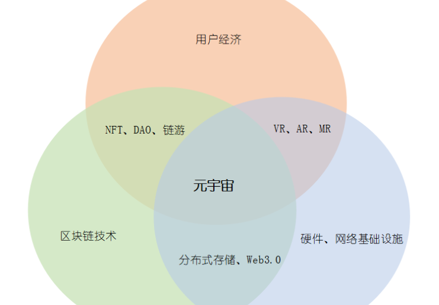
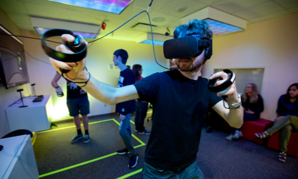

2021年以来，元宇宙热度持续上升，巨头们陆续宣布布局元宇宙赛道：

Facebook首席执行官马克·扎克伯格宣布，Facebook将改名为“Meta”（来源于“元宇宙”Metaverse），并将元宇宙开发作为未来公司发展的重心

微软在上周Ignite大会上表示，该公司正在调整其标志性软件产品，以创建一个更企业版的元宇宙

2021年4月，字节跳动花费1亿元投资了元宇宙相关游戏厂商代码乾坤；8月，字节跳动宣布收购VR龙头公司Pico

除此之外，一些商业领域之外的消息同样不断刺激着人们对元宇宙的遐想：

韩国首都首尔市政府近日宣布，将打造“元宇宙平台”，向市民提供公共服务

菲律宾央行考虑将元宇宙概念项目区块链游戏Axie Infinity归为支付系统运营商中国国家安全部直属事业单位中国现代国际关系研究院发布《元宇宙与国家安全》，讨论元宇宙对国家安全领域的影响

2021年12月，博鳌亚洲论坛（由中国举办的国际影响力最高的论坛之一）第二届科创大会区块链分论坛设立元宇宙主题环节，邀请政学商各界探讨元宇宙发展前景。

**那么元宇宙到底是什么？**

**有人说元宇宙 = VR和脑机接口技术的成熟**

**也有人说元宇宙 = 区块链技术在未来社会的深度应用**

还有人说元宇宙 = 物联网+区块链+云计算+大数据+5G/6G+超高速互联网+智能手机+虚拟现实+人工智能+元宇宙的确很难描述，因为它并非一个产品或者游戏，也不是由一个公司创造出来的，而是人类社会还未出现的一种新的交互模式和商业生态。

**真正的元宇宙应该能够实现这样的场景：**

佩戴上智能设备，你就可以在另一个在数字模拟的世界中进行社交、游戏、办公。这个世界更加精彩，足不出户就可以体验到身临其境的冒险经历。同时这个世界更具有可拓展性，每个人都是创造者，可以选择在元宇宙中不同的世界里建立自己角色的价值。

更重要的是，这个世界中将会有远比现实世界更加丰富的社群和经济生态，区块链技术支撑下的数字资产将可以跨界流通。比如你在游戏中打怪得到的NFT艺术品可以挂在你购买的虚拟房产的墙上，出售这个虚拟房产带来的收入又能让你在现实中获得一笔财富。

结合国内外科技巨头对元宇宙的布局，以及国外相关学者和媒体人的研究，笔者认为最终成熟的元宇宙将有三个构成要素：用户经济、硬件和网络基础设施、和区块链技术。

在元宇宙的形成过程中，三者互相作用，缺一不可。如下图。

这三个因素虽然各自处在不同发展阶段，但在当前的时间节点下，都各自对元宇宙的概念产生了强烈的驱动，并最终促成了当前元宇宙的爆火。

下面就来具体说说这三股元宇宙的内驱力，其中重点要说的是第三股驱动力——区块链技术，如何会成为元宇宙得以实现的关键。

**驱动力1：新的用户经济**

（关键词：注意力经济、用户生态、广告）

用户经济对元宇宙的内驱力，来自当前互联网用户经济发展中遇到的瓶颈。

用户经济的概念很宽泛，在传统互联网领域，既指一切通过满足互联网用户的需求实现的经济模式，也包含用户在一个产品上通过内容创作和互动形成的用户生态。但概括来讲，互联网经济的核心是用数字技术满足用户的各种需求，这里包含休闲放松的需求、便捷社交的需求、高效办公的需求、获取知识的需求等等。

一个不争的事实是，互联网经济的爆炸式发展已经进入了尾声，当前互联网已经很难刺激出更大的用户需求。

传统互联网改变了人们消费、社交和信息获取的方式，也相应地创造了电商、社交、搜索引擎三大互联网的盈利模式，但互联网想要进一步推进就遇到了需求饱和的瓶颈。

这其实很好理解，毕竟人们一天的时间只有那么多。

抖音这类产品试图最大限度地抓取人们的注意力，你可以上班路上刷抖音，甚至等红灯时刷抖音，但你无法在离开屏幕的时间和空间中刷抖音。

但元宇宙提供了一种突破限制的可能性。

元宇宙并非尝试用新的产品抓取注意力，而是试图通过创造一个全真的数字世界，把人们的办公、娱乐、社交、消费等行为整体搬到线上。

届时互联网将打开一个全新的经济领域，电商平台可以出售的数字资产将有可能超过实物资产的价值，社交平台会因为人们在元宇宙里身份的多样而出现更多的玩法，搜索引擎能够提供的内容也将比当前丰富无数倍。

对互联网巨头们来说，更重要的是再次打开了广告收入的来源，虚拟世界中的广告位会再次让他们挣得盆满钵满。

现在我们可能会认为这样的想法太过异想天开，但在互联网巨头早已有了逐步将人们带入元宇宙的计划。以内容作为吸引建立用户经济，是Facebook的想法。Facebook高管杰森·鲁宾曾经在一份文件中这样描述Facebook实现元宇宙的计划：

沿着当初的想法，如今Facebook已经布局了许多元宇宙游戏和开发者平台，其中包括收购VR“ 吃鸡”游戏《POPULATION:ONE》开发商Big Box VR工作室、推出VR健身软件 XR 版本的 FIT和Supernatural 、发布 VR 开发者工具平台 Oculus Developer Hub等等。

而Microsoft同样有自己的用户引导计划。

为了引导人们最终以虚拟形象进入到Microsoft Teams 的全真会议室中进行办公，Microsoft 打算在明年上半年在线会议软件中推出虚拟人物的功能。Microsoft Teams 团队的负责人贾里德·斯帕塔罗(Jared Spataro)表示，在最开始有一个参会者“以卡通人物的方式与你交谈，你不会觉得有不合适。”

通过全真达到元宇宙最初用户的积累，互联网巨头们是认真的，在硬件设备上的投入更说明了它们的信心。

**驱动力2：硬件、网络基础设施**

（关键词：XR、分布式存储、Web3.0）

硬件和网络基础设施的是元宇宙实现的支撑，这方面的驱动力一方面来自于AR、MR、VR等技术和脑机接口技术的进步，另一方面则来自于互联网数据传输、数据处理、数据存储技术的革新。

首先来看硬件设备，其中主要包括VR、AR、MR等混合现实终端。

VR、AR、MR技术如今被视作未来元宇宙的入口，这些技术的主要推动者仍然是互联网科技巨头。

Facebook是其中最早开始布局这个赛道的选手，早在 2014 年Facebook就以 20 亿美元全资收购了 VR 头显的初创公司 Oculus，进行 VR产品 的布局。收购完成后，脸书加大了 VR 业务上的研发投入，从每年 59 亿美元提升至近 185 亿美元，并早在 2015 年就发布了首款消费者版Rift虚拟现实头显。

苹果，谷歌，微软，华为等大型科技企业也都在争夺这个元宇宙的入口。分别进行了大量的技术布局和探索。苹果建立了数千人的AR研发团队并开发了ARKit ；谷歌为安卓平台开发了ARCore，方便于安卓开发者 对其进行调用与开发；华为利用麒麟芯片内集成的强大的AI芯片开发了HUAWEI AR Engine系统，实现了运动跟踪、平面检测、手势识别、手部骨骼跟踪、人体骨骼跟踪等重要的AR基础功能。

而脑机接口技术则展示出了人类意识与互联网更深层结合的可能性，也为元宇宙的实现带来了更多遐想。

但目前脑机接口技术尚不成熟，其中最著名的公司马斯克旗下的脑机接口公司Neuralink，主要从事马斯克所谓的“神经织网”（neural lace）技术开发，研发计算机与人脑融合技术，向人脑植入也许未来能够上传下载思想的微型电极。

除了硬件设备之外，元宇宙更大的驱动力还体现在互联网数据传输和数据处理技术，包括数据存储方面技术的革新。

这其中，人工智能为数字角色提供高互动性；云计算和边缘计算为元宇宙解决了推动效率；5G / 6G提供了宽阔的数据通道。

而互联网Web3.0时代最为关键的区块链技术，同样在以惊人的速度改变着互联网的形态。

讲到这里，本文的重点来了，那就是区块链技术对在元宇宙中的作用。

**驱动力3：区块链技术**

（关键词：去中心化、不可篡改身份、自治生态）

区块链技术作为元宇宙的驱动力，是元宇宙能够实现的核心要素。

区块链本质上是一个去中心化的互联网数据库，任何人都可以对这个公共账本进行核查，但不存在一个单一的用户可以对它进行控制。凭借加密算法的力量，区块链技术用数学的方法为人们提供了一种新的信任和协作机制。

这种信任和协作机制有两方面的意义，分别体现在上述的两个推动力——元宇宙的用户经济和网络基础设施。

**区块链与用户经济**

首先，在元宇宙的用户经济方面，区块链技术使得任何个人或组织都能够使用数字资产的数据，并能以数字资产为基础做商业模式上的探索。

于是，各类资产都可以转变为可以线上流通的数字通证（digital token），在区块链系统中广泛流转，即所谓的“通证经济”（token economy）。

这大大丰富了元宇宙的用户经济体系，使得在虚拟世界中创造一个与现实平行且同样复杂的经济世界成为可能。