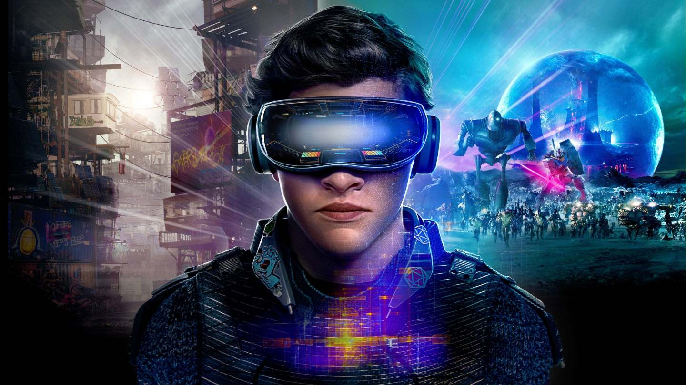

随着最近各方大厂开始布局“元宇宙”游戏，“元宇宙”这个概念也开始映入玩家的眼中。

说到“元宇宙”，大家第一个想到的可能是《头号玩家》这一部电影，电影中玩家穿梭于现实世界和“绿洲”之中，我第一次看的时候产生了很多疑问，比如——“这个游戏那么大，游戏服务器到底是存在什么地方？”“为什么大BOSS的游戏公司明明创造了这个游戏，但最后却没有这个游戏的掌控权？”“游戏中那么多琳琅满目的游戏道具，游戏策划是怎么把这么多不同类型的道具塞在一个游戏里面的？”直到后来我学习了区块链等相关技术才搞懂，下面我将围绕上面相关问题，一步步地去说明“元宇宙”游戏的发展阶段和相关实现方法。

首先“元宇宙”游戏的诞生不是一蹴而就的，目前“元宇宙”开发所需要的相关技术还在起步阶段，很多概念和方法甚至还没到理论可行的地步，根据我的学习和总结，我将元宇宙的发展过程总结为下面四个阶段：

**第一阶段：UGC平台游戏（单一游戏加用户自制内容）。**

这个阶段的游戏实现了**游戏形式多样性**。

比如目前大火的Roblox和LayaMe就是属于这个阶段的产物，这个阶段的“元宇宙”游戏实现了玩家娱乐和社交的需求，而游戏开放的编辑器可以让玩家自制很多各种各样形式的游戏内容供社区游玩。

但总的来说还存在着几个重要的问题没有解决，首先是游戏内容很多，但质量平均线和3A工作室的大作，乃至一些大型手游都没办法比，用户自制内容和大型商业项目存在差距，其次是游戏没有一个可以独立运转的经济系统，玩家没办法在这里面进行复杂的经济活动，游戏内的货币只限制在游戏内部使用，游戏厂商对游戏的经济系统有着生杀大权。

而NFT游戏也是属于这个阶段的内容，NFT游戏可玩性却不高，更多地是充当金融产品和作为加密艺术而存在，游戏属性有限。

**第二个阶段：多游戏互联。**

这个阶段的游戏实现了**游戏内容连通性**、**游戏资源自给性**、**游戏资产不灭性**。

如果单一游戏靠玩家自制内容没办法实现足质足量的游戏，那么将多个游戏连通在一起怎么样？多游戏连通则是这个阶段最大的特征，“元宇宙”最重要的特征是具有“文明性”，让一个虚拟的世界具备现实文明特征，最重要的第一步就是具有经济的流动性。

那要如何去实现这种流动性，首先一个游戏的货币可以在另一个游戏游戏中使用，然后就是货币的发行不会被个别个体和组织控制，Q币等游戏公司发行的货币就只满足前者，不满足后者。除了经济活动中的货币流通，游戏的资源的产出也需要完全由客观参数来控制，虽然现在的游戏的资源是由代码产出，但背后控制的是游戏公司的策划们，他们在游戏的资源分配上享有生杀大权，一个版本的某些参数的微小调整都可能造成游戏经济系统的崩盘。

而“元宇宙”需要的资源产出是不由单一的个人所决定，而是要由一些中立、客观的规则而产生。人类文明是一个熵减的过程，是地球依靠太阳的能量实现熵减，人类才能一步步实现复杂的活动和进化，太阳能来到地球通过各种形式转化成化学能、生物能等，最后变成人类的各种资源，而货币则是我们用来形容资源价值的等价物，太阳能的产出是不会被人类所左右。“元宇宙”要实现：**“货币能在多个游戏中使用”**、**“货币的发行不会被个别个体和组织控制”**、**“游戏的资源的产出由客观参数来控制，不会被个别个体控制”**这三点，则需要使用到区块链等相关技术。

区块链的发展目前提出的有1.0、2.0、3.0、4.0这几个阶段，但现在还处于3.0的摸索阶段，而“元宇宙”里的区块链起码要用到1.0-3.0里面的各种概念和技术。那我要做一个这个阶段的“元宇宙”游戏要怎么做？这里先强调一点，这个阶段的“元宇宙”游戏使用区块链技术不是要根据新技术去做出一个游戏，而是让已有的游戏和未来研发的游戏连通在一起，不然就又是在做NFT游戏，技术先行于游戏设计。

假如我是某个游戏大厂，我要做这个阶段的“元宇宙”游戏，只要**将游戏中的某种资源或货币换成区块链货币**，那要如何引入区块链系统？第一步就是先和其它的游戏厂商联合在一起要去设计一个区块链，然后分别在自家公司搭载服务器，让各个公司作为全节点成为矿工，组成一条**“联盟链”**，同时协议上限制矿工数量只有游戏各个厂商享有记账权，第二步，设计一个或多个游戏，将这个游戏的某种通用的资源货币与该区块链的货币绑定，将游戏后端与区块链中的某些节点联接，这一步实现有点复杂，简单点说就让游戏厂商通过矿机挖矿，然后把每个时间段挖到的货币通过**“智能合约”**这个技术分发到各个玩家账户。

“智能合约”的运用就是为了实现资源分配的客观中立性，当多个游戏都是使用同一条链，怎么分配这些资源就成了最大的问题，要是任由游戏公司来分配，各个游戏的工作室可能谁也不服谁，如果这个游戏分多点，那个分少点，评判的标准是什么，怎么保证大家都是按照这个标准来执行也是问题，所以“智能合约”的**不可篡改**这个特性可以保证资源分配的进行。

比如最简单的模型，我们使用单位时间内的“总玩家数量”和“总玩家的游戏时长”作为智能合约判断的节点，根据这个发放相应数量的货币给对应的游戏，对应的游戏又根据别的“智能合约”把从链上获得的货币根据玩家贡献的资源发放给玩家。

比如有A游戏、B游戏、C游戏，它们共同使用一个区块链S，而这个S区块链使用S币作为它的货币，矿工每个区块挖到的S币都会自动执行一个智能合约，这个智能合约将会根据ABC三款游戏内玩家总在线时长按比例将货币发放到对应游戏的总账户，然后对应游戏的总账户再将受到的S币通过另一个智能合约发放给各个玩家的账户，假如一小时内矿工挖了50个S币，然后ABC三个游戏的玩家一共总在线时长比例为1:1:3，然后ABC游戏分别能获得10枚、10枚、30枚S币，然后ABC三个游戏根据自己制定的分配规则分别编写一个“智能合约”，收到矿工的S币后再通过各自的“智能合约”按照玩家贡献发给全体玩家。当然对比起一条链给多个游戏使用，让一个游戏的资源作为主链、让其他游戏的资源作为侧链也可以实现类似的效果。

其中不仅仅游戏内的货币可以使用区块链代替，游戏内虚拟道具也可以通过**NFT技术**保存在玩家在区块链上的账户上。虽然这样子和以前的游戏系统看起来没什么区别，但虚拟道具与玩家的关系发生了变化。

使用区块链，玩家对虚拟道具的所有权将通过区块链永远的记录在链上，假如一个游戏关服了，这个游戏内的玩家账户拥有的道具记录将会留在区块链上，假如某天游戏厂商又重启了游戏，可以通过区块链把玩家的记录找回来。

比起传统的把数据存在单一服务器，使用区块链还有两个好处是前者不具有的，当游戏关服后，将“联盟链”改成“公链”可以让忠实的玩家成为全节点保存这些记录，就算关服了游戏内的虚拟道具所有权还可以继续通过区块链进行玩家间的交易，脱离游戏本身也是可以进行经济交易的，甚至一些别的游戏也可以通过这些记录把这个游戏的道具复现在自己的游戏里面，这样就可以解决前面“游戏中那么多琳琅满目的游戏道具，游戏策划是怎么把这么多不同类型的道具塞在一个游戏里面的？”这个问题，这个问题的关键不是怎么塞进去，而是为什么可以塞，而使用区块链就可以将多个不同的游戏道具的记录塞在一起，虽然这个阶段的区块链大都以“联盟链”而存在，但让“联盟链”成为“公链”仍是未来趋势和下一阶段最重要的条件之一。

举个极端的例子，假如D公司只有游戏D，这个游戏使用的是区块链D和D币，D区块链只和游戏D有关系，这个区块链协议规定只有a个矿工，而这a个矿工全部由D公司的设备担任，这个游戏里的虚拟道具都有一个专属的ID，玩家购买虚拟道具，购买的是虚拟道具的ID，玩家买到之后在区块上发布一条交易，将所有权的记录放在交易的域上。如果有一天D游戏关服了，要怎么样处理玩家的财产和区块链D？这时只要通过修改协议，将矿工的数量n扩大到无限，然后区块链形成分叉，然后公开让玩家一起来担任矿工，一旦矿工数量足够多，D公司就可以关闭矿机，从此玩家的数据就存放在玩家的手中，只有还有一个忠实的玩家还肯继续存着，游戏就没有灭亡，而且对比某些游戏关服后，把数据冷备份，一直把数据扔在仓库里面，D游戏就算是关服了，游戏里的虚拟道具依旧可以通过区块链交易，一旦D公司重启游戏，只要通过修改协议，造成区块链的**硬分叉**，由于游戏厂商是服务的提供者，玩家又会乖乖回到新分出来的链上，就好像**eth**和**etc**一样，而且还存在别的情况，比如游戏私服也可以使用这些记录作为账户数据，又或者游戏D可能不会复活，但它的继任者游戏E将D区块上的数据绑到了一起。

在这个模式下，游戏厂商的地位也会发生变化，从一开始中心化模式下，游戏厂商拥有绝对的控制权，就算是使用到了区块链，从一开始的单一游戏厂商单一中心，变成了多个厂商多个中心，由于技术问题，比如交易吞吐量有限等问题的影响，矿工会由厂商控制，虽然厂商的控制权比以前减弱了，但是由于厂商之间的相互制衡，经济系统不会被某一个游戏策划一拍脑的决定而毁掉。由于区块链上货币是直接发放到玩家的手中，不经过厂商，厂商的盈利模式也发生了变化，厂商从**使用虚拟道具交换玩家现实中的货币**，变成了厂商**使用虚拟道具的所有权ID交换玩家手中的区块链货币**，但由于虚拟道具是无限的，但区块链货币是有限的，随着区块链货币流向厂商的账户，玩家手中的区块链货币就会越来越少，玩家就只能使用现实的货币向游戏中最大的区块链货币持有者——“游戏厂商”交换区块链货币。

可以说区块链货币此时的信用价值还是取决于“厂商能给玩家换什么样的道具”，看起来这样的模式和传统的模式没有什么不同，但由于区块链的设计不是单一的游戏，区块链货币的信用则是由多个游戏共同决定，只有设计的更好的游戏才能在这个交易循环中获取到更多的货币，倒逼开发者去设计相关内容。玩家能换到什么就取决于厂商，同时厂商能交换给玩家的也不仅仅是虚拟道具，还有游戏内的养成资源，厂商不仅仅要考虑怎么让区块链货币流入到自己的游戏，还有怎么让区块链货币从玩家账户流入到厂家的账户。

同时这个模式与厂商传统的获利模式是不冲突的，两种系统是可以同时放到同一个游戏下的，我既可以一边用现实货币换虚拟道具，也可以用区块链货币换虚拟道具，系统的接入实现不算困难，就算是已经发行的老游戏也可以专门创造一些道具接入区块链系统，而且新接入的游戏能否从这个系统中赚到钱取决于厂商内容的设计，接入后把道具贬值增值、通货膨胀这些问题完全交给玩家交易流通就行，开发者专心负责研发就行。

前面说到游戏中的货币资源可以使用到区块链，养成资源也可以使用到区块链。使用**NFT技术**，可以增加很多玩法，甚至可以实现一些以前玩家就提出的功能。如果是个SLG游戏，可以将矿藏的所有权放在里面，通过智能合约，玩家一旦攻下矿，智能合约将当前状态作为节点判断依据更改所有权所属，同样MMOARPG副本的所有权或者副本的攻占记录也可以永久留在区块链里面，对于一些休闲游戏的房产也可以放在区块链当中。

总结一下，这个阶段的“元宇宙”游戏，限制最大的是计算机算力、储存和玩家生产内容的技术，若是让一个游戏同时拥有ACT、SLG、AVG等多种类型的内容，游戏体积会变得巨大无比，Roblox这些UCG平台提供的轻量级开发，虽然可以兼容很多内容，但游戏内容天生就存在量级小的问题，而多游戏互联可以初步解决游戏质量不足这个问题。

这里定义链接各个游戏或者不同内容之间的游戏或平台叫做**“公共领域”**，多游戏互联在“公共领域”上的设计会比较复杂，Roblox天生就是“公共领域”，链接着无数用户自制内容，而多游戏互联本身是没有“公共领域”，需要另外设计，如果说区块链将多个游戏的系统链接在了一起，那么“公共领域”就决定了玩家的体验，如何让玩家从“公共领域”进入到一个游戏之中，再从一个游戏进入到另一个游戏，这期间保证玩家的体验连贯，需要计算机图形学技术和物理硬件算力、储存技术的保证，这个也是限制这个阶段“元宇宙”发展的最重要的因素。

（“为什么大BOSS的游戏公司明明创造了这个游戏，但最后却没有这个游戏的掌控权？”所有权只要使用公私钥控制，这样就可以很轻松做到）

**第三个阶段：云、MR、AR、VR。**

云技术是解决计算机算力与储存问题的最好的方法，游戏体量也可以放大到无限大，创作者不在需要为游戏体积而担忧，当多游戏互联发展到足够的水平，加上计算、存储加载等技术的成熟，游戏体量不成问题，一个整体的游戏和多个游戏互联之间的界限将会被打破，人们也不会分辨的出“公共领域”与其链接游戏的界限。而**AR、MR、VR**这几个技术则是增强玩家体验最主要的技术。

但是这些与玩家体验最为相关的技术只是第二阶段到第三阶段最表面的变化。前面我提了“玩家生产内容的技术”一嘴，而第二阶段到第三阶段转变的内核关键就是这个**“玩家生产内容的技术”**，只有“玩家生产内容的技术”足够成熟，才能推动普通玩家也能生产出优质的内容，才能让个人开发者与厂商站在同一高度，迫使厂商把原来由多厂商控制的**“联盟链”变成公开的“公链”**，让所有玩家都参与到元宇宙的建设中来，玩家和开发者的界限被打破，游戏厂商变成了比较大的开发者，而不是唯一的内容生产者。

算力与储存问题的解决只是让这种转变实现技术上的可能，而“玩家生产内容的技术”才是让玩家-游戏厂商之间的**生产关系产生变化的关键**。

同时前面“这个游戏那么大，游戏服务器到底是存在什么地方？”这个问题，一开始是存在“联盟链”各方的服务器之中，但储存与分布式系统的相关技术一旦成熟，“联盟链”转为“公链”之后，游戏的文件不仅仅存在云端，也可以存在各个节点的玩家主机中。

**第四个阶段：元宇宙。**

《头号玩家》般的、独立于现实世界的“虚拟世界”，要想实现像这样的世界还需要生物技术等的发展，这太过遥远就不过多赘述。

**总结**

最后做一个小总结，目前现阶段我并不是很看好目前的元宇宙项目，目前的链游，某种程度上来说，是过去区块链金融项目的延伸，本身金融属性要比游戏性更加突出，简单点来说就是目前的项目好玩这个属性都很难做到。

就现阶段未来5年来讲，相比于区块链游戏化，我更加偏向于游戏资产部分区块链化，这个是更容易做到的，同时也不会对现有的游戏行业产生颠覆，更多的会是对已有功能的延伸与升级，游戏内货币部分区块链化，可以让多款游戏的资产进行互通，而让游戏内资产NFT化可以更好地实现资产的收藏价值。但若想实现这样的初级目标，有两个比较困难的地方需要解决。

**第一是法律问题，** 目前我国对于公链在法律法规上还是比较严格，抛开国家法律禁止问题，即使是在国外发行项目，也会存在平台所有权等问题，特别是上链之后，资产会被锁死，忘记私钥，没办法通过GM手段找回，像是国内经常发生的未成年人超额充值的问题，放在区块链上几乎就是无法找回，只能厂商吃哑巴亏，过去Q币达成了目前区块链货币在平台通用性上的功能，但是涉及到跨行交易、交易所属权等法律问题上，厂家为了方便，还是设计了点券等手段，使得Q币等产品还要再多一步在游戏内转换为对应货币的步骤，为的就是规避上述问题，但是放在元宇宙上，这些问题不会消失，而且还会变得更加复杂，厂商面对这些问题，是否还要将货币区块链化就是需要更慎重考量的问题，如果这样做并没有显著提高玩家的体验，而且还增加了成本就没必要将货币上链，而且steam的交易市场其实已经实现了上述交易的大部分功能，除了游戏之间的道具还不能在不同游戏中互相使用之外，仅仅在玩家交易上，这样的交易市场已经很符合未来的使用情景了，而且也并不是所有类型的游戏都需要这样交易市场，在国内除了《梦幻西游》、《DNF》这样的老牌MMO，其实大部分都不需要玩家间的交易系统，而且国内具有开发和运营这样的交易系统能力的厂家少之又少，未来上链的交易系统也只会比这种交易系统更加复杂，干这种吃力还不一定讨好的东西不会是小厂商应该首先考虑，而且游戏最重要的始终是游戏性，并且对于资产上链这个问题，我也有个问题想要相关从业者想一下：“产品经理里有一句老话，不要为用户创造需求，为游戏资产上链是不是一种创造需求的行为？”

**第二是技术问题，** 问什么我在前面要强调“部分”资产上链，对于游戏来说，玩家数据的吞吐量是很恐怖的，即便是体积很小的游戏，游戏内的道具产出和消费的数据量都是十分恐怖的，像BTC需要数分钟才能确认一笔交易，ETH也要到秒级，肯定不适合作为游戏的货币载体，而且考虑到汽油费，在速度和成本上都不适合放到这种大吞吐量的系统上，而现在的链游很多都是通过侧链等方法，设计成一些比较出名的区块链的主链的侧链，用主链的信用来背书，牺牲一部分的去中心化，来实现交易速度。

但是游戏数据处理即使是放在P2P的系统上都是一个难题，上链只会更加复杂，我们在P2P时代都没能解决的问题，那么快就快进到区块链时代，问题只会被更加放大，短短几年几乎是不可能能完成，所以目前来说区块链不可能三角形，我觉得最应该被抛弃的是“去中心化”，由此我更加看好私链和联盟链的发展，除了可以避免一部分法律的问题，更容易实现安全性和交易速度。

但总的来说，要说上链和过往的交易系统最大的区别是什么，至少在体验上，资产上链了，给我们的感觉其实并没有什么不同，上链能给我们带来新事物其实是两样，一是资源可以由智能合约的方式产生，二是为玩家资产和道具可以在不同游戏中使用向厂商提供了一个好的方法，什么时候“系统自动产生资源，不被人为修改“和“游戏间道具可以互用“这两者成为玩家和厂商的刚需，才是应该考虑上链的时候，而目前游戏当中，还没有需要这两者和用到这两者的出现。