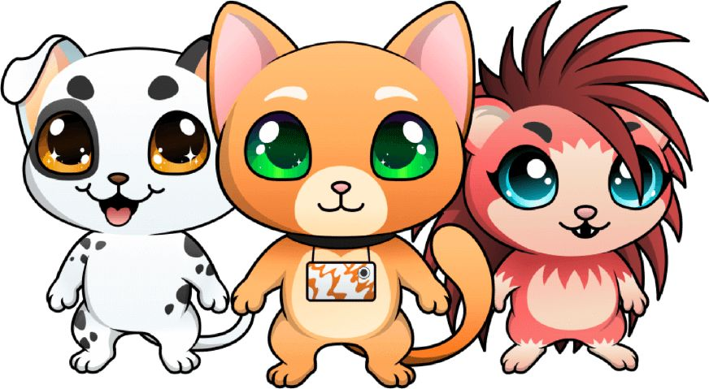
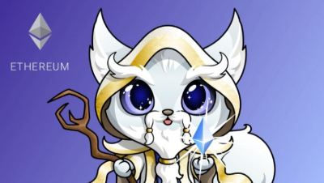

元宇宙年间媲美大航海时代的大迁，人们全方位走入数据全球，开辟鸿蒙、创世为之。造就、日常生活、游戏娱乐，乃至工作中的数据时光便是元宇宙。

元宇宙时期必须再次思索存有和虚空、肉身和精神实质、性善和性恶、自身和地球的哲学思想出题，必须全方位结合区块链技术、VR与AR、5G、互联网大数据、人工智能技术、3D打印出等新技术应用，产生数据造就、区块链资产、数据销售市场、虚拟货币、数据交易的新模式。许多权威专家觉得，互联网技术的终极形态便是“元宇宙”。

Mega Crypto Polis元宇宙游戏开发，Sorare元宇宙游戏开发，save the moon cat元宇宙游戏开发，Blockchain Pet 元宇宙游戏开发，My Crypto Heroes元宇宙游戏开发。

作为一家专业的链游开发团队，当下我们这边有着足够的元宇宙游戏开发经验，从外界销售市场状况看，时下元宇宙定义爆发，促进了手机游戏行业的快速发展和升级，促使眼底下游戏行业有着非常容易转现的销售市场环境。

据统计，微软的前CEO纳德拉是第一个认可元宇宙使用价值的大中型科技公司执政官，他觉得“虚拟现实游戏全球即现实世界里的元宇宙”，并明确提出用网游世界顺从相对应群体、替代传统式休闲活动。微软本次回收暴雪游戏，恰好是其合理布局元宇宙的实际反映。

据了解，暴雪游戏在PC端手机游戏、主题风格手机游戏行业均具销售市场优点，早已产生自身的IP引流矩阵，在其中的《魔兽世界》、《先锋》等手机游戏商品特别是在适用合理布局元宇宙。

在元宇宙时期，针对大部分企业而言，怎样在全新升级虚似的全球中方案和完成各类作用，这一工作能力将来将变成取得成功的重要。在持续转型的数字时代里，怎样作出恰当的挑选，踏入最适宜的跑道呢？而这恰好是元宇宙策划师充分发挥之处。