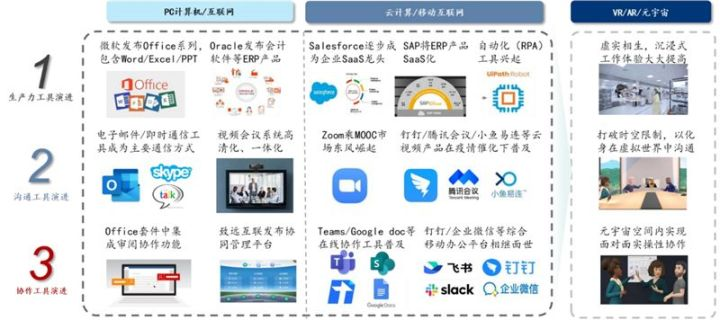
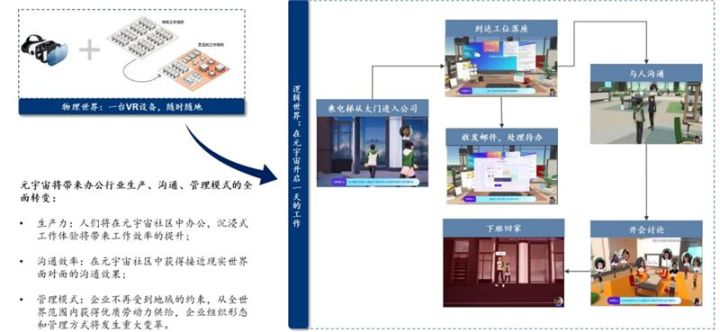
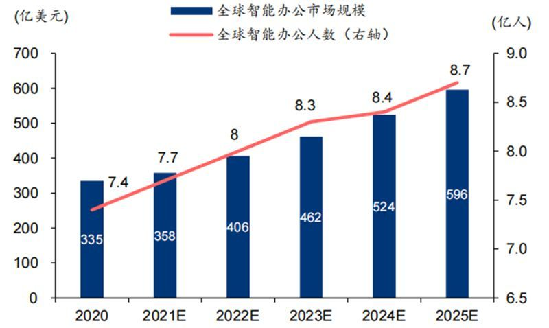
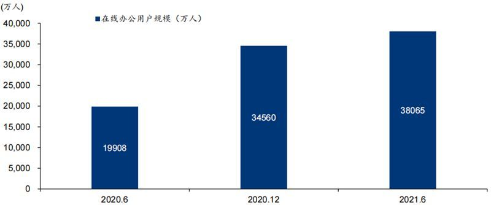
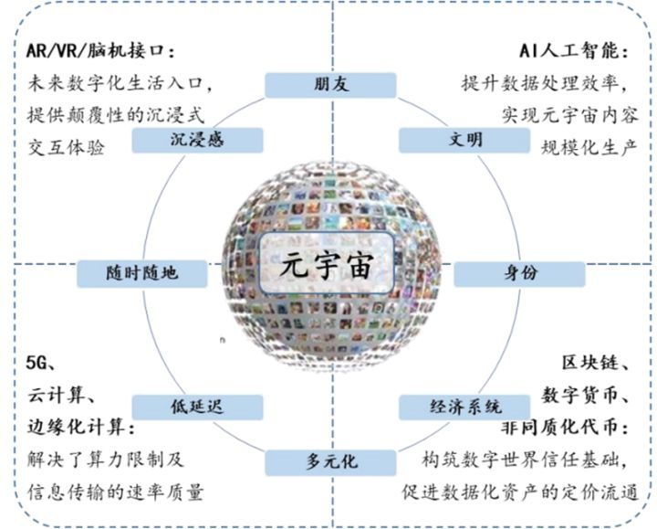
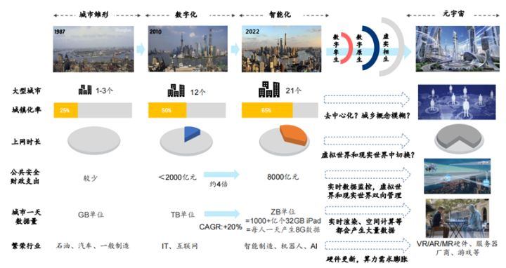
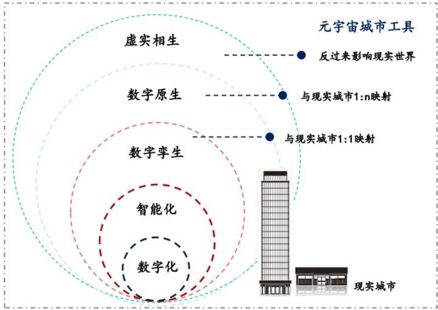

作为互联网的下一站，元宇宙将改变办公、城市、工业等多个企业业务的形态，带动社会生产力提升、生产形态变革、进而改变产业链及价值分配模式。

我们认为元宇宙带来的行业变革将集中于三个维度：1）生产力提升：办公效率、沟通效率、政务管理效率以及工业研发效率的提升有望受益于元宇宙发展；2）生产形态变革：企业组织形态、城市形态、工业生产形态有望发生变革；3）相关产业链及价值分配重塑。

**从数字孪生到虚实共生**

元宇宙将在办公、城市、工业等企业服务领域广泛应用，带动生产力提升及产业变革。过去十年，我们见证了移动互联网发展带来的社会变迁及生产力进步，元宇宙作为人类未来数字化生产活动的场景，将同移动互联网一样，在办公、城市、工业等 To B 领域广泛应用，提升生产力，改变业务形态，重塑产业链及价值分配模式。

科技在 To B 领域的应用往往涉及研发、生产、协作、管理等多个环节，一方面，科技在研发、生产等环节的应用能够带来效率的提升，另一方面，科技在协作、管理等环节的应用则会引发产业形态和价值链结构的变化。

**类比数字化时代，元宇宙也将在 To B 领域的各个环节作为先进的生产力工具发挥 重要作用，并引发社会形态的变革。具体而言：** 

1）办公领域，元宇宙将作用于生产、沟通环节，显著提高工作效率，并推动劳动力供给全球化，带来企业组织形态和管理模式的变革。

2）城市领域，元宇宙介入城市管理及城市服务，城市管理方面，隐私计算技术将从多个维度提升城市管理效率，虚拟空间中的城市应急管理有望提高城市决策能力；城市服务方面，AR/VR 将提升人与城市交互质量，数字人的引入将提升智慧城市服务水平。

3）工业领域，工业数字孪生技术为工业生产流程的各个环节均带来变化，对于研发及生产环节，元宇宙下的高算力大大提升了效率；对于运营及集成环节，元宇宙使得工业产业链上下游的联系大大加强，管理协作更加高效。

图1：元宇宙对办公、城市、工业等To B领域影响

**随着元宇宙在 To B 领域广泛渗透和应用，该领域相应的产业链及价值分配模式 也将发生变化。具体而言：** 

1）办公领域，产业链将自上而下发生软硬件更新迭代。硬件方面，原有的 PC、手机、平板等终端人机互动特性增强、智能化程度不断加深，VR/AR/脑机接口等新兴终端逐步应用和实践；软件/系统方面，协同办公平台将向元宇宙办公社区演进。

与之相对应，短期内，后疫情时代混合办公模式成为常态，视频会议/在线协作/流程自动化等产品将得到普及和应用，相关公司如 Zoom、亿联网络、致远互联；长期而言，元宇宙办公社区将逐步走向成熟，Meta、Microsoft等科技巨头在该领域率先布局，已有试运营产品。

2）城市领域，智慧城市布局带动行业估值的提升已开始显现。智慧城市产业包括三部分：上游智慧城市设备制造，主要是硬件和软件的开发，以海康威视、大华股份、宇视科技（未上市）等为代表；中游智慧城市建设运营，由政府机构负责顶层设计，系统集成商、运营服务商和解决方案提供商共同参与，以中兴通讯、中国移动、中国电信等为代表；下游智慧城市场景应用，包括政务、交通、安防、医疗、物流等领域。

由于机器视觉首先在安防领域成熟，同时也作为海量数据的输入口，安防成为智慧城市率先落地的场景之一，数据量的加大也将带动算力需求和数据存储业务。

3）工业领域，数字孪生技术将改变工业生产的各个环节。研发设计类，以底层技术为主线，如中望软件、广联达；生产控制类，以行业 know-how为主线，如中控技术、宝信软件、柏楚电子；运营管理类，以管理模型为主线，如用友网络；协同集成类，以协同能力为主线，如上海钢联。

**办公：三大维度赋能办公行业** 

**数字化时代，办公行业生产力、沟通、协作工具不断演进，持续带动生产效率及沟通协作效率提升。** 

1）生产效率方面，20 世纪 70 年代以来，以 office 为代表的数字化办公应用迅速普及，电子表格及电子文档替代纸质文件，显著提升了办公效率；随后，ERP 将数字化整合到工作流中，核心业务流程精简，消除不必要的重复性工作，带来生产力提升；2015年以来，RPA 等自动化办公工具兴起，部分职能工作由机器取代，自动化程度进一步提高。

2）沟通效率方面，PC 互联网时代，电子邮件和即时通信工具成为企业主流通信方式，初步实现了基于 Web 的点对点式离线沟通；移动互联网时代，云视频会议和无缝共享促使沟通协作由非实时向实时转变，提高了人们快速响应新数据和信息的能力，保障了业务的持续性；

3）协作效率方面，协同办公范围不断扩大，Teams/钉钉/企业微信等综合协作平台使得数据、会议、电子邮件和聊天一体化，团队联系更加密切。

图2：数字化办公行业发展历程

元宇宙时代，工作形态将发生转变，人们将能够随时随地进入办公室，在一个有“虚拟形象”的3D空间开展一天的工作。

在此情境下，企业生产、沟通、协作三个维度均有望实现进化：沉浸式的工作体验将带来工作效率及创造力的提升；元宇宙社区中的沟通有望接近现实世界面对面的沟通效果；企业雇佣的员工遍布世界各地，全球化协作促使其组织形态和管理方式变革。

图3：元宇宙下的工作形态：生产、沟通、管理模式全面转变

**疫情催化数字化办公市场渗透率提升。** 

根据 Market Insights 测算，在疫情推动下，2020 年全球智能办公市场规模达到 335 亿美元，全球智能办公人数达到 7.4 亿人。根据 CNNIC 数据，2020 年 12 月，我国远程办公用户规模达 3.46 亿，较 2020 年 6 月增长 1.47 亿，占网民整体的 34.9%，后疫情时代，有越来越多的企业建立起科学完善的远程办公机制，企业微信服务用户数从 2019 年的 6,000 万增长到 2020 年 12 月的 4 亿，钉钉企业组织数量超过 1,700 万，在线办公使用率由 2020 年 6 月的 21%提升至 2021 年 6 月的 38%。

图4：全球智能办公市场规模及人数

图5：我国在线办公用户规模（万人）

后疫情时代，数字化办公边界服务对象不断拓展，产品平台化趋势明显。一方面，据CNNIC，截至 2020 年 12 月，视频或电话会议使用率为 22.8%，在线文档协作编辑为 21.2%，在线任务管理或流程审批为 11.6%，企业云盘为 9.4%，不同细分功能的用户使用率存在显著差异。

随着阿里（BABA US）、腾讯（700 HK）等科技巨头入局及行业个性化需求增长，在线办公市场逐步向平台化方向发展，散落的“工具应用”将进一步被集成，更多垂直功能接入，实现生态互联。

另一方面，随着经济环境、供需关系和商业逻辑变化，协同管理软件已脱离传统办公的范畴，走向业务协作和业务管理，服务对象开始从企业内部延伸到外部供应商和合作伙伴，一些头部协同软件不仅支撑企业内部门户构建，也支撑企业外部门户构建，触达供应链和客户。

图6：协同的边界由组织内向组织外扩张

数字化办公市场按照服务对象和功能可细分为生产力工具、沟通工具及协作工具三类：1）生产力工具：辅助个人生产力和工作效率提升的工具，如以 Office 为代表的办公套件、以UiPath Robot 为代表的自动化办公产品等；2）沟通工具：辅助实现团队之间远程沟通的工具，如以 Outlook 为代表的企业邮件系统、以 Zoom、腾讯会议为代表的视频会议系统等；3）协作工具：辅助组织在线协作的工具，如以腾讯文档为代表的在线协作文档、以 Teams为代表的在线协作系统等。

图7：数字化办公市场可细分为

**生产力工具、沟通工具和协作工具三类** 

元宇宙时代，VR/AR、云计算、AI、区块链等底层技术的发展将驱动办公行业 生产力工具、沟通工具、协作工具全面进化。

具体而言，1）VR/AR 技术的成熟一方面能够带给员工沉浸式的工作体验，激发创造力，提升工作效率，另一方面，VR 会议比视频会议更加贴近现实世界面对面的沟通效果，能显著提升沟通效率；2）云计算/边缘计算等网络基础设施的发展提升了信息传输的速率及质量，实现异地沟通的高实时性及高互动性，促进协作办公范围进一步扩大；3）AI 等人工智能技术融入具体办公场景，使得办公智能化程度进一步提升；4）同时，区块链技术作为数字世界的信任基础，有望解决元宇宙时代数据安全及个人隐私保护等问题。

图8：元宇宙四大核心技术支撑：

**VR/AR、人工智能、云计算、区块链** 

元宇宙带来的变化1：VR/AR 沉浸式工作体验能激发创造力，提高工作效率和沟通效果。 一方面，远程办公存在着损害创造力、减弱团队凝聚力等问题，据微软混合办公白皮书，远程办公模式下，人们的人际交互活动更加单一，疏远关系网的互动频率低，这会导致创新的停滞和趋同思维，而元宇宙中的“化身”能让彼此感觉处在同一空间内，提高凝聚力， 增强疏远关系网的互动频率，这些优势都将显著改善目前远程工作中的痛点。

另一方面，Eric 等学者在《Virtual memory palaces》中的研究表明，由于人们的认知和记忆部分依赖于空间感，因此在虚拟现实空间中的练习比屏幕前的练习效果更好，在虚拟现实空间下， 人们的认知能力和工作效率有望进一步提升。

VR 会议替代视频会议，能够最大限度的缩小与面对面沟通的效果差距。在元宇宙办公世界中，3D 分身代替演讲者在会议中出现，并通过运动追踪技术实现分身与现实演讲者的动作同步，这种沉浸式的交流方式能够在最大限度上接近现实中“面对面”的沟通效果。根据Facebook 发布的《视频及 VR 会议比较：沟通行为研究》，在视频会议中，对话回合少，话题转换更为正式，85%的沟通因肢体语言的缺失而受到影响，同时，演讲者较少接收到听众的反馈；而在采用化身的虚拟会议中，肢体语言的使用和听众反馈的频繁能显著提高沟通效果，对话回合明显增多，这种你来我往的讨论方式更贴近自然情形下的人类交流。

当前的元宇宙办公产品已能够通过音频提示、手势追踪等方式营造沉浸式的沟通体验。例如，在微软的 Mesh for Teams 产品当演讲者说话时，将采用音频提示使得脸生动起来，让替身拥有更具表现力的动画效果，营造临场感。而 Facebook 的 Workrooms 支持头部和手势跟踪，现实生活中用手所做的任何事情都将在虚拟世界中被跟踪和再现。

比如，如果你转头看同事或房间白板，你的视野会随着你一起平移；如果你给另一位同事竖起大拇指，你的虚拟化身也会在会议室里竖起大拇指。

元宇宙带来的变化2：借助 AR 协作系统进行“面对面”远程指导，协作范围进一步扩大 AR。等技术的发展为远程协作提供了更多的可能性，“协作”一词的范围由简单的数据、文件共享场景逐步渗透至需要直观的“面对面”共同动手的实操性场景。在实操性场景中，AR 远程协作可通过 AR 眼镜或者具备 AR 功能的手机等采集声音音频，通过无线网络传输到后台协助端，借助 AR 远程协作系统，实现由经验丰富的技术人员进行“面对面”远程指导。当下代表性的主流 AR 远程协作平台包括：Microsoft Dynamics 365、Atheer ARMP、Scope AR WorkLine Create 等。

元宇宙带来的变化3：云计算解决异地沟通临场感问题，促使劳动力供给全球化。 随着 5G/云计算/边缘计算等网络基础设施不断发展，低延时、高速率、大带宽的网络以及对海量、高渲染画面的实时计算能力能够解决异地沟通临场感问题，使得异地办公也能实现高实时性、高互动性，很大程度上还原真实的工作场景。

在此基础上，企业可以打破地理限制，从全球范围内招聘员工、外包人员，丰富组织成员协作方式，重构组织运转流程，从全世界各地获得劳动力补给，这也将极大程度上改善当前世界范围内劳动力供需不匹配的问题，促使人口由城市中心向城市边缘迁徙。

元宇宙带来的变化4：AI 提供实时翻译、键盘追踪等功能内嵌，办公智能化程度提升。成熟的 AI 技术是元宇宙办公实现的前提，VR 会议中手势追踪、音频提示等功能的实现均依赖于人工智能技术对现实世界的识别和解析，因此，元宇宙办公天然就与 AI 技术紧密结合，并能够借助 AI 技术进一步实现工作及沟通效率的提升。

例如，微软的系统实现了多人实时会议、线上方案共享、同时内嵌了实时翻译和转录文字等协作办公方面的实用功能，解决不同人种之间语言沟通障碍；Facebook 为了能让用户更方便地使用面前的实体键盘，在 Horizon Workrooms 加入了键盘追踪功能，结合适用于 Mac 和 Windows 的全新 OculusRemote Desktop app，用户可以一键访问 PC，还可以在会议期间做笔记，将文件带到虚拟现实，甚至可以选择与同事共享屏幕。

在数据安全问题上，对于个人而言，沉浸式世界中新技术将在一个人的步态、眼球运动、情绪等越来越细微的层面上收集个人数据，这给现有的个人隐私保护带来更大压力。对于企业而言，核心数据和系统全部上云，如何在元宇宙底层资源不断更新和扩张时实现数据资源合规收集、储存和管理尚待探讨。

区块链技术作为数字世界的信任基础，有望在未来为元宇宙中的数据安全及隐私保护提供有效的解决方案。在人员流动问题上，从传统集中式转入远程工作模式后，人们足不出户便可换工作，且远程工作模式下企业凝聚力有所下降，这使得企业人员流失率有所提升，据麦肯锡统计，远程工作后中国工作变更率增加 13%。

元宇宙的加入将自上而下改变在线办公领域产业链及价值分配。终端硬件及软件/系统解决方案为在线办公市场产业链中两个最主要的环节，在元宇宙时代，两者都将迎来演进及变革。1）终端硬件方面，互联网时代以 PC、平板、IP 视频电话、USB 会议室摄像头等智能终端为主，思科（CSCO US）、亿联、华为（未上市）等企业通信终端龙头占据绝大部分市场份额，元宇宙时代，终端硬件形态将向 VR/AR、脑机接口等新兴设备演进，“信息-眼-脑”的传输方式被简化为“信息-脑”两个环节。

2）软件/系统解决方案领域，协同办公平台/云视频软件向元宇宙社区演进，元宇宙社区内沉浸式的社交体验有望提升疏远关系网的互动频率，相应的，协作办公的外延也将扩大，协作范围从企业内部业务线延伸至供应商/合作伙伴/客户，这就要求各个公司的元宇宙之间可以自由连接，不同元宇宙社区在软硬件兼容、平台转换上形成国际共识。

图9：元宇宙带来办公领域软硬件变革

目前，Facebook、微软等巨头已开始在软硬件领域演进方向上布局。在硬件领域，除人们熟知的 VR/AR 外，Facebook、Valve（未上市）、Neurallink（未上市）都入局了脑机接口，Project Steno 方案可以分析瘫痪患者大脑皮层负责语言的部分，并解码为完整的文字。未来，这项脑机接口技术可能用于光学 BCI、EMG 腕带等非侵入式消费级产品，甚至作为 AR眼镜的输入方式。

在软件/解决方案领域，微软和 Facebook 两大巨头在元宇宙办公领域的布局思路略有不同。在办公元宇宙的定位上，1）微软致力于成为元宇宙联通之间的“粘合剂”。微软 CEO Nadella认为未来将是“多元宇宙”的格局，“联通性”成为不可忽视的价值创造部分。微软将 Teams想象为元宇宙的原型，公司可以在其中建立自己的虚拟空间，而将 Mesh 视为提供基础粘合剂的角色，帮助多个元宇宙连接在一起，微软的 Mesh 允许公司使用 API，帮助公司构建自己的元宇宙，并在所有的这些虚拟世界中拥有持久的身份。

2）Facebook 则强调各个元 宇宙场景之间的联动。Facebook 将办公作为其元宇宙布局的八大场景之一，强调各个场景之间的联动，以 Horizon Home 为入口，扩展到办公应用 Horizon Workrooms、社交应用Horizon World 及活动应用 Horizon Venues 等场景。

**城市：虚实共生对城市管理提出新要求** 

城市是人们生活和生产的重要载体。从城市雏形到数字化、智能化进程中，大型城市数量在不断提升，而我国的城镇化率也从 20 世纪八十年代的 25%左右提升到现在的 65%，政府在公共交通和公共安全上的支出持续增加，随着城市空间复杂度的提升，城市空间的管理方式和管理效率有精细化、模块化、场景化趋势。互联网的崛起引导人们生活向线上转移，上网时间不断拉长。在城市演变过程中，城市管理的需求根源来自于对城市数据的充分挖掘和高效利用，最终使得各部门在业务层面实现职能协同。

图10：城市在管理结构、公共监控技术、城市形态等

**多方面正发生变迁** 

城市演变1：城市复杂度增强，管理半径增加，多维度管理成为趋势。监管内容：城市整体形态方面复杂程度增加，从人物的多维度监管价值被不断放大。生活工作的多样性大大提升了城市物理空间构造的复杂程度，赋予了城市更多的定义和内涵，也催生出更多数字应用场景。城市的管理分成三大阶段：

**第一阶段：线下阶段。** 城市的管理维度已经覆盖了物理世界的人流管理和车辆管理，例如智慧交通系统管理解决方案利用 AI 算法做到高精度违法判别，全路网视频监控，目前可做到自动取证，给出预测分析及辅助执行；智慧生活监控解决方案可以做到客群流量实时监控，自动预测客流高峰，精准排除违规和危险行为。

**第二阶段：全连接阶段。** 随着 5G 通信、大数据等技术的深度应用，各类基础设施正在连接网络，城市的管理维度正在进一步扩张，将基础设施、环境等城市元素数字化并纳入线上管理的范畴：如智慧环境监测解决方案能实现实时地环境监测并精准识别各类影响环境的违规行为。

**第三阶段：互动阶段。** 更近一步地，城市基础设施将在虚拟世界形成数字孪生，居民在虚拟世界中将和城市基础设施的数字孪生形成互动，因此城市的管理范畴从传统的线下变为线上线下的联动。如现有的智慧网络安全解决方案将针对网络各类违规内容分析和识别，对违规信息精准高效审核，而未来针对基础设施的网络安全问题将受到更多关注。

在多样化的场景中，数据重要性凸显，日益庞大的算力需求成为城市发展的底层动力。管理半径增加的趋势既考验着技术发展水平，也考验着城市管理机制，跨部门、跨线上线下的合作将变得更加频繁，如何协调部门的管理半径，共享城市数据变得更加关键。

图11：城市管理维度从管人向管物延伸

监管主体：经历技术驱动-政府主导-社会共建三个阶段，更考验政府的统筹能力。随着城市化进程的加快，城市管理的方式也在发生变迁。过去在探索期，主要依靠大型技术公司通过 IT 技术集成解决城市运营垂直领域问题。

步入 2010 年之后，政府侧重于基于城市发展需求整体规划部署，以此来提高城市运营管理质量。而目前，城市服务更倾向于政府引导，引入公民、企业参与城市建设，通过打通问、办、查、档四个步骤实现服务高效。

同时在组织设计上，与传统城市管理模式相比，智能化城市更强调监管分离，将信息收集和监管评价职能剥离开来，设立了专业部门如市政管理委员会、环卫部门、民政部门等，以及行政部门如区政府、街道办事处、社区委员会等。这种推行主体演变的趋势更加强调了城市管理参与方的多样性，也更关注数据在各部门和各参与方之间流动的时效性和保密性。

图12：政府管理架构

**城市演变2：** 智能化便民服务提升效率。疫情下政府服务“提质增效”需求迫切，一卡通打破数据孤岛。我国政务数字化经历了四个阶段：1）“一门一窗一网”：由入驻政务大厅统一受理，政务系统逐步统一门户，网上办理开始兴起；

2）全国全省一体化平台：政务实现全省通办、全国通办，采集到的电子证照实现全省共享、全国共享；

3）业务流程优化改造：政务系统走向整合，政府致力于实现业务流程优化，减少材料，同步开始启动人脸认证、简易审、智能批、秒批等特色业务；

4）主动式智能服务：以用户为中心的主动智能服务开启，政务更注重沉浸式和随时、随地、随需、随行的服务体验。我们看到，在疫情的影响下，政府公共服务持续面临“提质增效”挑战，政府利用大数据、云计算等技术在一窗集中办理，线上线下一网通办上实现了新的突破，而未来在层级、地域、系统、部门、业务之间的有效融合将成为城市服务趋势。

**数字化、智能化城市到元宇宙城市：** 从 1:1 映射到 1：n 映射最终到虚实世界相互影响 数字孪生是目前最贴近元宇宙城市的应用。在智能化城市之上，城市管理者正在将数字孪生概念从原来的航天、工业领域引入到城市建设中。数字孪生是整个城市的数字模型或实物资产的副本，它赋予实体城市一个具备 1:1 映射的数字克隆体，以此实现全要素的数字化、虚拟化以及全状态的实时化和可视化。从城市管理角度出发，整个城市的数字孪生可以有效地协助城市规划以及实物资产的运营和维护。

数字孪生在城市领域的应用强调对实体空间的精确复现，可对城市的物理空间发挥模拟、预测等作用。通常认为，元宇宙是在精准模拟物理空间运行的同时，创造数字空间中的原生体验，探索数字空间中特有的生活方式和社交形态，进而实现数字空间反向影响物理空间。通过对城市演进的探讨，城市系统未来的发展会在思维方式上从数字化走向智能化，进而从数字孪生走向元宇宙。

在数字孪生的基础上，元宇宙强调了多元主体的互动效果，使得原有的虚拟平台不仅提供可视化能力，更实现了虚拟和现实的全面连接和高度协同。在元宇宙思维下，市民可以通过多层次参与到城市的虚实互动、交互反馈，帮助实现系统的完善和自适应优化。

图13：元宇宙是城市建设的下一个方向

元宇宙对城市产业生态建设给出了终极指引，围绕元宇宙概念下的城市建设进程有望加速。以数字孪生为基础的智能化城市已经初具雏形，并继续沿着演变思路在城市管理和服务上有较大突破。更进一步我们看到，在游戏、影视、政府工作安排等角度已经开始对元宇宙城市提出了畅想。

元宇宙带来的变化1：隐私计算技术提升多维度城市管理效率。多模态数据的所有权、使用权和管理权分离一直是城市发展过程中的难题，而元宇宙作为超大数据集合体，不仅要保护用户数据的隐私，更需要考虑挖掘和体现用户的数据价值。

我们认为，在区块链技术的基础上，隐私计算可以保证元宇宙世界里与用户相关的原始数据不被泄露、用户的隐私不被暴露。同时由于元宇宙需要获得更高的数据价值和虚拟空间体验，会将数据调用出来训练，并进行细颗粒度挖掘和实时同步，全范围的隐私计算技术将让数据在保持加密状态以及不泄露给使用方的前提下，实现计算合作。未来隐私计算将成为元宇宙时代城市管理的重要技术，不断提升跨世界中的城市数据管理的效率和安全性。

目前部分厂商正在探索将区块链与隐私计算相结合的技术路径。其中 PlatON2.0 基于隐私计算网络搭建了一个去中心化的人工智能市场，以实现 AI 资产的共建共享和敏捷的智能应用开发，提供从 AI 算力、算法到 AI 能力及其生产、部署、集成的全流程产品和服务。

根据 2.0 白皮书的规划，AI 开发人员可通过隐私计算协议连接 PlatON 的去中心化隐私计算网络，在保证数据隐私安全及合法合规的基础上，以较低的成本获取所需的资源（数据、算法和算力），用来训练 AI 模型并可发布到网络上，与其他 AI 服务或代理交互，逐渐构成自组织的协作的人工智能网络。

元宇宙带来的变化2：AR/VR 赋能应急管理。目前在应急管理方面的设想是利用 AR 智能眼镜、无人机+地面全景相机远程监测，实现地空一体化，而实时回传现场的超高清视频将提供精准的灾情变化情况。灾情现场一线检测救援人员在系统前端通过 AR 智能眼镜、VR 摄像头采集声音、影像及数据，将现场高清视频实时传递给远程专家，让现场技术人员与全球任何角落的专家一起跨平台的协作。

更进一步，元宇宙时代由于现实世界实时映射的属性，城市反映的问题将全量映射到元宇宙中，而管理者可以通过元宇宙中观察事件的动态，提前发现态势的变化，从而为现实世界的城市治理提供模拟决策，相比于目前城市事中监控事后追查，元宇宙的管理技术更侧重事前。元宇宙世界的模拟应急事件也将更贴近真实场景，参与主体有望更广泛。此外，我们也看到目前城市应急管理由于部门不同的权责划分，难以实现全局统筹，而在元宇宙的世界里，规划建议的效率提升将进一步显现。

元宇宙带来的变化3：数字人提升智慧城市服务水平。在英伟达（NVDA US）2021 年 GTC 大会上，我们看到数字人在外语对话、餐厅服务方面的雏形开始显现，而将数字人引入政务服务等场景，让数字人充当智能前台、智能顾问，则可以将政务服务人员从重复性的咨询类业务中解放出来，从而优化整个业务流程，实现提效降本：1）无柜台远程服务：远程支持社保/公积金/医保业务办理、政策咨询等线上服务，AI 客服 24 小时在岗；2）高效化业务导办：强大的行业知识库，结合高效的人机互动方式，让每一个提问都能及时得到回答；3）智能化员工培训：培训机器人主导的业务岗前培训、智能助理学习辅助、媲美真人的人机练习。

**工业：数字孪生对工业流程的变革是主线** 

工业软件的本质是以数字化模型或专业化软件工具沉淀工业经验。理解工业软件，不仅仅是从工业或者软件的单向角度去理解，而是应该从这两个要素双向的相互影响的角度来理解。工业化先进程度决定了工业软件的先进程度，工业软件的先进程度决定了工业的效率。

回顾数字化时代工业软件的发展过程，我们发现可以从软件和工业两个维度来总结数字化带来的变革。软件维度来看，工业软件的商业模式迭代是以工业企业的需求迭代为基准进行的。工业维度来看，产业链不同的价值分配和数字化需求决定工业软件的作用。

软件维度来看，工业软件在数字化时代的商业模式变化以需求为导向。随着工业企业不断使用工业软件，对经验累计的范围和形式不断提出更高要求，工业软件厂商根据需求反馈进行快速迭代优化，是工业软件生存与发展的基本模式。

发展历史来看，工业软件伊始是以工具软件的形式出现，只解决工业企业的单点需求；随着工业企业的零散化需求被逐步解决，又提出了多场景数字化的需求，由此发展出了系统化平台；随着单一企业需求被解决，针对不同企业之间的供应链需求，发展出了云部署平台；随着工业企业终端硬件的多元化和零散化发展，工业软件又朝着工业互联网方向发展。

工业维度来看，产业链位置决定价值分配和数字化需求。工业企业产业链各个生产环节涉及的核心资源以及场景需求重点各不相同，进而产生了不同的价值分配和数字化需求的侧重，最终衍生出不同类型的工业软件。

**1）研发设计：** 研发及设计是生产制造的前置环节，对于工业企业的创新能力、知识产权、数据利用等能力提出较高要求。针对企业研发设计需求，工业软件发展出了 CAD（工业辅助设计）、CAE（工业辅助工程）、CAM（计算机辅助制造）、EDA（电子设计自动化）等产品。

**2）生产控制：** 工业企业的制造过程早期涉及原材料生产、原材料加工等生产环节，此时对工业企业的要求集中在资源获取、生产效率、固定资产成本等要素上。基于这些需求，陆续出现了包括 MES（制造执行系统）、DCS（分散控制系统）、PLC（可编程逻辑控制器）、SCADA（数据采集与监视控制系统）等工业软件产品。

**3）运营管理：** 工业企业的制造过程后期涉及产品组装以及成品加工等生产环节，此时劳动力成本、管理效率以及工业链的完整性对工业企业尤为重要，依此需求工业软件行业发展出了 ERP（企业资源计划）、CRM（客户关系管理）、WMS（仓库管理系统）、LMS（物流管理系统）等产品。

**4）协同集成：** 生产制造完成之后的工业流程一般包括物流、市场营销以及售后服务等，考验工业企业的渠道覆盖、价值挖掘能力以及文化影响力等。而针对工业企业的 OA（办公自动化）、IM（及时通讯）的协同集成类产品则很好地满足了下游企业需求。

复盘工业软件发展历程，我们发现从数字化时代到智能化时代再到元宇宙，工业软件与工 艺流程总是共同演进。对标数字化、智能化所带来的变革，我们认为元宇宙同样有望以沉 浸式交互、大算力整合等代表性技术，带来产业变革与投资机会。

数字化时代代表性技术以图形化和自动化为主，主要变革意义在于解放劳动力。工业数字化进程大致始于 20 世纪 50-70 年代，以图形化、自动化为代表性技术，将计算机设计、调度等能力首次带入工业生产领域，替代人工操作，解放大量劳动力的同时提高生产效率。

这一时期的典型代表，如 20 世纪 50-60 年代出现的 CAD 软件，以全新的图形化设计界面，提供计算机辅助设计能力，替代传统手绘设计，使得工程设计环节效率大大提升；又如上世纪 60-70 年代出现的 PLC 软件，通过基于微处理器的电气自动化控制，实现工业生产部分或全部流程的自动化控制。

以 CAD 软件为例，在 CAD 出现之前，一切机械、建筑设计都只能由工程师手绘完成，而CAD 则通过图形化的交互界面，大大简化设计过程，缩短工程周期。根据洛克希德公司数据，利用数控机床生产 C141 飞机的 1500 个零件，每条生产线的平均准备时间为 60 小时，而计算机制图软件可以节省超过 10 个小时的时间。

随着 70 年代实体造型技术的不断完善，三维图样可以在 NC 中自动编程，CAD 真正实现了从辅助绘图到助力生产。典型 CAD 产品如 CAD 鼻祖 SKETCHPAD、全球 CAD 霸主 Autodesk 旗下的 AutoCAD。

智能化时代核心能力主要包括建模和仿真，通过软件重新定义生产流程。随着计算技术不断发展，算力及其应用方式实现创新突破，仿真和建模技术开始进入工业生产领域，以数字化的仿真改造流程、指导生产过程。

这一时期的典型代表，如 20 世纪 70 年代前后出现的 CAE 产品，通过对工程和产品进行建模分析，从而在生产之前测试产品可用性和可靠性，减少实物样机实验带来的资源浪费；又如 20 世纪 80 年代左右出现的 MES 产品，以计算机建模复刻工业生产流程，从而实现对工厂生产过程的控制和管理。

以 CAE 软件为例，在 CAE 出现之前，传统生产过程需要经过“产品设计-样件制造加工-实验测试-成品试产-量产-销售”的过程，而 CAE 软件的出现，则通过计算机仿真分析，解放实验过程，以虚拟样机替代物理样机，将工程周期缩短为“产品设计-CAE 分析-成品试产-量产-销售”，节省大量费用开支。以飞机制造过程为例，需要从结构力学、流体力学、电磁学等层面，对飞机进行鸟撞分析、多体动力学分析、机翼静力分析等，而 CAE 的出现则为这类分析提供了虚拟化实现方式，避免了实验建造真实飞机带来的资源浪费。典型 CAE产品，如达索 SIMULIA、ANSYS Fluent、Altair HyperWorks 等等。

以沉浸式交互、大算力、人工智能为代表的元宇宙技术，为工业领域带来生产力升级。复盘数字化时代、智能化时代的工业生产变革，我们发现，在新技术驱动下，工业软件与工业流程往往共同演进、相伴相生。

而随着元宇宙在工业领域的渗透，以沉浸式交互、大算力整合为代表的元宇宙技术开始为工业生产领域带来新的变化。如 AR/VR 技术的出现，使得工程专家能够远程指导生产过程；大算力的整合使得仿真效率提升，元宇宙 AI 路测成为训练自动驾驶系统的新选择。

图14：从数字化、智能化再到元宇宙

**工业软件与工业流程共同演进** 

**元宇宙带来的变化1：** AR/VR 技术加持，打破生产协作时空限制。工业生产领域的办公协作在虚拟现实技术加持下突破物理空间限制。随着元宇宙概念催生大量 VR/AR 技术落地，用户可以通过穿戴 VR 头盔等设备进入虚拟现实场景中，实现沉浸式体验。当这一技术应用于工业场景时，现代工业生产过程有望打破时空限制，实现虚拟环节下的生产协作。

**元宇宙带来的变化2：** 整合大算力，突破仿真设计瓶颈。模拟仿真过程涉及大量计算过程，存在算力瓶颈。传统的仿真设计过程，往往需要使用 CAE软件实现对真实物理世界的建模还原，进行多物理场耦合，仿真过程极其复杂。

仿真过程中涉及的物理场包括动力学场、化学场、静电场和磁场等，涉及学科包括理论力学、结构力学、声学、热力学等。

因此，仿真模拟需要计算机提供大算力支持，以确定更佳的设计参数、实现更好的仿真效果。理论上来说，更大的算力支持往往意味着更加精确和真实的仿真结果。然而受制于个体算力瓶颈限制，企业较难以本地部署的方式进行 CAE 仿真设计，从而阻碍了仿真设计过程的顺利推进。

**元宇宙以平台化方式，整合大量低成本算力资源。** 

以元宇宙领先企业英伟达为例，从 2018 年Parker 问世的三四年间，英伟达将芯片算力提高了几百倍，据英伟达官网，Orin 芯片采用了7nm 的生产工艺，可实现每秒 200TOPS 运算性能，相比上一代 Xavier 系统级芯片运算性能提升了 7 倍，而在运算性能提升巨大的情况下，Orin 的功耗仅为 45W。通过将大量芯片算力资源进行整合，英伟达以 Xavier、Orin 等平台模式，为自动驾驶提供算力平台和仿真训练。

**元宇宙带来的变化3：** 加速云化，带动 PS 估值提升。工业软件云化是数字孪生的前置条件，工业元宇宙有望加速软件云化进程。从全球工业软件发展趋势来看，云化是其中的重要方向之一。而工业数字孪生将传统软件环境转化为虚拟现实环境，天然适合进行云化，且本地化部署方式往往难以满足数字孪生所需的算力要求，因此更加需要进行软件云化以适应场景需求。随着 Autodesk（ADSK US）、PTC（PTC US）、ANSYS（ANSS US）等工业软件巨头纷纷入局工业元宇宙，头部玩家带来的示范效应将进一步加快工业软件云化进展。

元宇宙的概念爆火，但大家总是会将元宇宙与“游戏和娱乐”联系在一起。但是，作为下一代信息革命的载体，将同移动互联网一样，在办公、城市、工业等 To B 领域广泛应用，对人类的生产力产生深刻的变革。