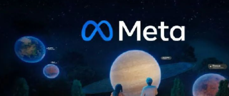
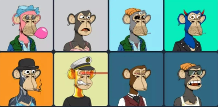
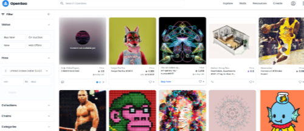

现在大家是不是经常听到“元宇宙”这个名词，我想大家是不是对这个词语很陌生，感觉虚无缥缈，不知道是什么概念，但在越来越多的场景中，这一词语出现的越来越频繁。下面我将给大家分享一下什么是元宇宙以及元宇宙延伸的数字藏品。

🔅元宇宙的概念最早起于 1992 年由科幻作家 Neal Stephenson 在他的科幻小说《Snow Crash》中第一次被提到，小说中塑造了一个人们可以透过虚拟化身在 3D 虚拟世界与他人化身之间互动的奇妙世界，这些是当时的人们想都不敢想的事情。

从元宇宙的定义，我们可以用“第一性原理”简单归纳出其主要的核心特徵有永续性、沉浸感、开放性及经济系统。

🔹其中，支持区块链的开放式支付和清算系统，用以解决用户在元宇宙世界的实时、公平、透明、快速的 P2P 支付需求。

🔹再来，元宇宙中用户的虚拟物品或创新成果应该可以被标记转化为数位资产，并支持进行交易、转让、投资等行为，以鼓励用户透过持续创新来获得财富。

🗣 网路的发展成熟为元宇宙提供了连接的计算能力、低网路传输以及大量的虚拟交互环境，包括游戏、电影等；渗透式交互设备则为玩家进入元宇宙提供完全真实、持久且流畅的交互体验，是真实世界与元宇宙的步伐。

🗣 而2021年随着各大科技、数位产业的积极关注，“元宇宙”成为近期最火热的话题。

🔅2021年3月，美国游戏公司Roblox于纽约证券交易所上市，上市说明书内首次提及了“Metaverse”元宇宙一词，开始带动元宇宙风潮。

🔅在新冠疫情爆发后，人们失去不少社交互动的机会，元宇宙一跃成为未来网络的世界。

🔅Facebook创始人扎克伯格在10月底更将Facebook直接改名为Meta，又在全球掀起了一波元宇宙风潮。

🗣 也许在未来，人们能在企业打造出的元宇宙世界里，开启新的生活与互动方式。比起现实社会，可能会开始习惯在虚拟世界中社交、学习、玩乐。未来的孩童也许可以与朋友相约在元宇宙的游戏世界中打怪、进入社群平台聊天游玩，透过目镜等装置享受沉浸式的社交生活体验。

什么又是数字藏品呢？接下来来聊一聊数字艺术藏品，前不久一个用寿司拼装而成的熊猫雕塑，在购物平台拍卖以1675元成交，说是说雕塑其实只是一张gif动图，能够360度旋转展示，你买家要欣赏自己的藏品，就只能通过手机专门的小程序来观看。

有专家表示，随着数字艺术藏品登录多个拍卖平台和APP，数字艺术藏品已经悄然来到了我们的身边。

数字艺术藏品的第一次大规模出圈是2021年8月NBA球星库里更换了社交媒体账户的头像，一只蓝毛的猿猴,为了这个无聊猴的头像，他花了18万美元，随后人们发现余文乐、陈柏霖这些明星也将社交媒体的头像换成了这样的数字艺术品。

人们就有疑问，这么一张图片都可以随意的复制下载，感觉谁都能用。为什么价格这么高呢？

这样得说回数字艺术藏品的属性，数字艺术藏品是通过对图像和视频文件等进行加密所生成的无法复制的数字签名，这就有点像达芬奇的画，人们可以复制他，欣赏他，但原版只有一幅，目前不少传统的艺术品也开始数字化，尝试给它变成数字艺术藏品来参与拍卖，比如国画油画作品。

有专家表示，随着网络覆盖率及率的增高，数字藏品会越来越普遍，至于这个价格是不是还会像现在这么高，这有待市场的检验。数字艺术藏品收藏要我说尽管它是虚拟的，但还是得有价值有内涵，这样才能走得更远。