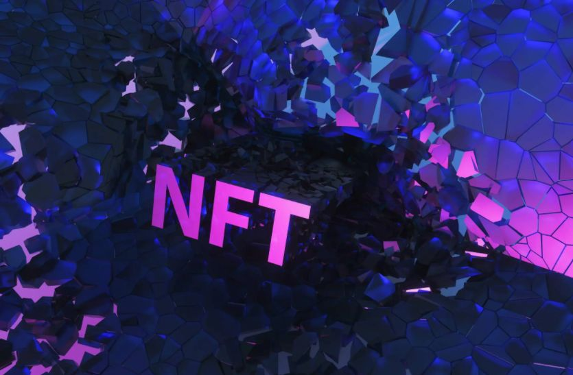

近一年以来，元宇宙热度居高不下，而金融业内多家银行已开始布局元宇宙。

**截至目前，已有三家银行发布元宇宙NFT（Non-Fungible Token），即非同质化代币化数字藏品，对此，中国文化管理协会乡村振兴建设委员会副秘书长、高级数据分析师袁帅表示，NFT实现虚拟物品的数字资产化和流通交易，带动数字资产的价值重估，丰富银行产品生态，不过，数字收藏品亦存在一定风险。**

除此之外，银行业已有多家银行布局元宇宙领域，包括智能机器人、数字员工、入驻第三方元宇宙产品等。而监管部门亦对其中相关风险作出提示，中央财经大学证券期货研究所研究员、内蒙古银行研究发展部总经理杨海平认为，商业银行应警惕元宇宙相关信用风险、操作风险及信誉风险。

**1、银行开发元宇宙数字收藏品** 

**袁帅向《中国科技投资》记者表示，2022年元宇宙延续火爆态势，元宇宙浪潮同样给银行金融领域带来新变化。以数字收藏品为例，目前，多家银行已上线数字收藏品。**

2021年11月18日，中信百信银行股份有限公司（以下简称“百信银行”）宣布发行“4 in love”四周年纪念数字藏品，该藏品基于区块链技术发行，具有唯一性和不可篡改性，为银行业首个NFT数字藏品。百信银行首席战略官陈龙强对外表示，“此次发行数字藏品是我们迎接元宇宙的一次尝试，作为下一代互联网，未来银行与客户的交互方式、产品服务方式乃至银行形态都可能发生重大变化”。

今年1月13日，农业银行陕西分行联合“Hi元宇宙”，推出抗疫小豆“城市英雄”系列数字藏品，共分为“小豆医护”“小豆警察”“小豆志愿者”“小豆军人”“小豆环卫工”五款。资料显示，“Hi元宇宙”为陕旅集团旗下陕西骏途网文化旅游科技股份有限公司与陕西博骏文化控股有限公司共同推出的数字文创交易平台。

1月17日，深圳前海微众银行股份有限公司（以下简称“微众银行”）表示将于1月25日一次性生成和分发数字藏品，即“福虎”项目，该数字福虎的发行总量为20.22万张，其创造、分享、领取、合成、查询等一切操作皆为免费体验，且不支持转赠、交易。

上述数字收藏品均具有唯一性。**袁帅表示，“从行业正向发展促进的角度来看，NFT数字艺术品解决其作品版权的确认、作品发行和流通数量的控制和盗版防范等问题，并提供更丰富的互动和商业化方式。”**

**袁帅进一步补充道，NFT实现虚拟物品的数字资产化和流通交易，带动数字资产的价值重估，“数字藏品的受众是对新产品、新技术、新概念感兴趣的年轻群体，这部分人群消费意愿和消费能力较强，且是银行的优质客群。银行发行自己的数字藏品，提高其影响力的同时增加银行业务收入来源，也可以为客户发行数字藏品，并根据数字藏品的价值，实现向客户鉴权、授信、抵押、转化等金融服务，丰富银行产品生态，提升资金周转效率。”**

“不过，数字藏品亦存在一定风险”，袁帅分析称，NFT的发展尚处于探索阶段，存在诸多风险点：NFT生态项目大多数集中于以太坊区块链，在BTC、COCOS、EOS、IOST等公链分布相对很少；NFT整体概念较为超前，商业模式不清晰，技术领域投入和发展速度可能造成垄断现象；该技术尚且过于依赖底层技术，架构方风险系数较大；另外数字货币等相关制度、法律尚不完善，存在政策或监管风险。“银行又是金融行业，是对风控和风险保障要求很高的领域，面对NFT存在诸多尚待完善的风险点，银行业在涉足创新探索元宇宙数字藏品领域时，一定要慎重，做好风险保障评估”，袁帅如是说。

**2、监管提示防范元宇宙相关风险** 

**袁帅表示，目前，无论是国有银行还是股份制商业银行，都在寻求数字化转型，加速实现线下业务和服务的线上化和移动化，更便捷高效地为客户服务。**

2015年，光大银行正式推出智能文字机器人，名为“阳光小智”；2019年末，南京银行推出AI数字员工“晶晶”和“楠楠”，2020年，该行推出数字员工营业厅，开启元宇宙场景应用与商业银行业务流程和客户服务的融合。

2021年12月3日江苏江南农村商业银行股份有限公司与京东智能客服共同合作推出VTM数字员工；同年12月13日，浦发银行与百度联合打造的数字员工“小浦”正式“上岗”；与此同时，12月30日，百信银行公布该行虚拟数字员工“AIYA艾雅”正式入职该行，成为银行的“AI虚拟品牌官”。

今年2月9日，宁波银行上海分行001号数字员工“小宁”入职，为银行客户提供各类业务咨询和办理服务。此外，天眼查显示，宁波银行于近日申请注册了多个元宇宙相关商标，包括“宁波银行元宇宙”“汇通元宇宙”等。

除虚拟员工外，去年12月末，工商银行河北雄安分行 “入驻”由百度公司打造的元宇宙产品“希壤”；今年1月，江苏银行宣布开始积极布局金融元宇宙；同时，浙商银行位列中国移动通信联合会元宇宙产业委员会公布的首批成员接纳名单。

杨海平认为，元宇宙内涵丰富，涵盖生活、生产和政务场景的数字孪生，“我们建立数字孪生城市，是为了利用这个数字孪生城市更好地管理真实的城市；我们建立数字孪生园区，一定是为了更好地管理园区的运行”。

不过，针对不法分子以“元宇宙投资项目”“元宇宙链游”等名目吸收资金，涉嫌非法集资、诈骗等违法犯罪活动，2月18日，银保监会处置非法集资部际联席会议办公室发布《关于防范以“元宇宙”名义进行非法集资的风险提示》，揭示包括编造虚假元宇宙投资项目、打着元宇宙区块链游戏旗号诈骗、恶意炒作元宇宙房地产圈钱、变相从事元宇宙虚拟币非法谋利等4种活动。

杨海平表示，监管部门提示以元宇宙之名开展的非法集资风险，尤其及时；对此，银行应坚决执行，在服务客户的过程中，做好宣传，适时对客户发出提示。杨海平建议道，银行可关注元宇宙的发展，但不应轻谈布局元宇宙。

那么，商业银行在进行元宇宙创新时应注意哪些风险？对此，杨海平进一步分析道，一是警惕元宇宙相关信用风险，由于规制和技术的原因，元宇宙投资项目未来发展不确定性较大，且元宇宙相关技术基础和技术路径均不成熟，“元宇宙是与实体世界相对独立的数字化虚拟世界，如果不加以规制，会对现实世界的政治治理、社会秩序、伦理规范产生较大的冲击。因此，对元宇宙施加伦理和制度约束就在眼前。”

“二是警惕元宇宙相关操作风险，由于元宇宙概念热炒，需警惕部分IT公司和咨询机构利用欺骗手段，引诱银行投入。三是警惕元宇宙相关的声誉风险，部分不法分子以元宇宙之名，行不法之实，千方百计与银行员工和服务挂钩，资本集团借元宇宙无序扩张，也想竭力借助银行信誉”，杨海平补充道。

另外，杨海平认为，商业银行围绕元宇宙创新应遵循两个原则：一是不能背离服务实体经济的初心和使命，利用数字员工服务于客户生活，或者将数字员工“派驻”于生产场景、政务场景，在优化客户与银行交互的基础上改善服务体验，但若引导资金脱实向虚，则应该坚决杜绝；二是不能背离社会的公序良俗，银行作为重要资源的配置中介，应将资金和其他服务资源投向符合国家发展战略，符合社会公序良俗的方向，不应支持过度虚拟化、娱乐化。