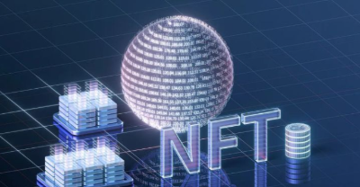
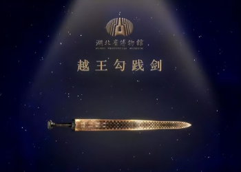

**2021年年中，国内数字藏品平台开始兴起，2021年也被认为是“NFT元年”，目前阿里、腾讯、京东等互联网巨头已经纷纷入局，竞争愈演愈烈。** 

继“元宇宙是个筐，什么都可往里装”后，数字藏品作为资本热捧的新赛道，火速升温。一张图片、一段音频、甚至一幅涂鸦，都可以在数字技术的加持下“点图成金”，摇身变为独一无二的数字艺术品而走上交易平台。

**数字带来全新收藏体验**

最开始把数字藏品“点燃”起来的是国外。2007年5月1日，数码艺术家迈克·温克尔曼(Mike Winkelmann，又名Beeple)开始在网上发表新作，之后13年半里，他每天都创作并上传一幅新的数码作品，取名为《每一天》。

2021年2月25日起，佳士得打包了他这5000天创作的五千件作品，使用NFT技术上链并放在网上拍卖，底价为100美元。来自全球11个国家的33位买家参与了竞投，其中85%是佳士得的新客户，经过二十多天竞拍，这件看上去仿佛一个剪辑预告片的作品以69,346,250美元被化名Metakovan的一位融资人竞得，他同时也是世界最大的NFT基金、新加坡Metapurse的创始人。

这一事件引起了许多人的关注和好奇——**什么是NFT？**

**一般认为，NFT是指基于区块链技术的非同质化代币（Non-Fungible Token），是用于表示数字资产（包括jpg和视频剪辑形式）的唯一加密货币令牌，可以买卖；也可理解为一种运用了区块链技术的数字资产所有权证明。**不同于比特币等同质化代币，NFT具有不可分割、不可替代的特性。每个NFT都代表一份独一无二的数字资料，作为虚拟商品所有权的电子认证或证书。简单来说，NFT就像数字资产的身份证，它能够指向数字艺术、游戏、域名、门票等任何内容，使其成为可以永久拥有、保存、追溯的数字资产。

去年以来，有关NFT的“大事件”屡见不鲜。

·2021年3月18日，外媒报道，埃隆·马斯克的推文，包括配文、剪辑和歌曲一起被当作NFT在网站上出售。截至3月16日，最高出价达112万美元。

·2021年7月13日，北京国声京剧团将自己的京剧作品周边在NFT网站上出售，首个京剧NFT出现。

·2021年11月，腾讯、字节、小红书、百度等7家互联网巨头进军NFT。

**·**2021年12月17日，阿迪达斯（Adidas）正式推出了一系列“走入元宇宙”的非同质化代币，并于发售后数小时内就卖出了将近 3 万个。以每份 0.2 ETH 的价格来算，29620 个 NFT 的销售总额轻松突破了 2200 万美元。

·2022年1月1日，元宇宙平台Ezek联合周杰伦名下潮牌PHANTACi首次限量发售NFT项目Phanta Bear(幻象熊)，发行上限10000个，单价为0.26个以太币(约人民币6200元)，总价超6200万元。

·2022年4月，周杰伦在社交平台上发文称，其持有的 BAYC #3738 NFT 已被盗。

......

在国内，NFT更多地以数字藏品的形式为人们所熟知。

**数字藏品是使用区块链技术进行唯一标识的经数字化的特定作品、艺术品和商品**，每个数字藏品都映射着特定区块链上的唯一序列号，不可篡改、不可分割，也不能互相替代。从目前的技术来看，音乐、门票、潮玩、卡牌、画作、摄影作品、GIF动图、表情包等都可以做成数字藏品。

**数字藏品具有区块链唯一标识，具备稀缺性和不可篡改性、可溯源性。**数字藏品在增加艺术作品流动性的同时，也让艺术创作者获得分成，享受艺术创作带来的成长价值。而数字藏品与文娱领域的结合，也让文娱领域打开了新的空间。

业内人士普遍认为，目前国内发行的数字藏品，技术原理与NFT基本一致，但在发行渠道和交易方式等方面存在差别。海外市场的NFT多是基于以太坊等公链发行确权，与虚拟货币直接或间接挂钩。我国监管部门一直严令禁止虚拟货币交易炒作，在这一背景下，目前国内市场的数字藏品主要依托各平台旗下的联盟链发行，且大部分主流平台都禁止数字藏品的二级交易，弱化了金融属性，降低了炒作风险。

自2021年以来，数字藏品这片新蓝海正在吸引更多主体加入，行业生态圈已经初现。

**科技大头纷纷入局数字藏品，延伸范围越来越广**

**掌握区块链等相关技术的头部互联网企业，正成为数字藏品的平台搭建方。**

2021年6月，支付宝联合敦煌美术研究所，在“蚂蚁链粉丝粒”支付宝小程序上限量发布了“敦煌飞天”和“九色鹿”两款付款码皮肤；同年8月，腾讯上线了“幻核”应用软件，首期限量发布“有声《十三邀》数字艺术收藏品”；京东也紧随其后，于12月上线灵稀数字藏品交易平台。有头部互联网企业作信用背书，这些平台发布的产品大部分一经推出即被抢空。

作为掌握重要资源的文化机构，**博物馆已成为数字藏品主要的IP方之一。**众多“深藏”在博物馆里的珍贵文物，正在以虚拟的方式被大众所了解和收藏。河南博物院发布的文创数字藏品“妇好鸮尊”，售价19.9元，限量1万份，一秒内即宣告售罄；湖北省博物馆发行的1万份镇馆之宝“越王勾践剑”的数字藏品，同样上线即售罄；四川成都金沙遗址博物馆基于太阳神鸟、大金面具等文物推出的6万份数字文创也在50秒内售罄。

**由于数字藏品自带“流量”，这股热潮也逐渐延伸到其他领域和行业。**

5月15日，腾讯视频发布了电视剧《且试天下》中的人物角色Q版形象数字藏品。这款藏品由电视剧《且试天下》官方授权，腾讯视频唯一发行，腾讯至信链为数字藏品的发行和交易提供区块链底层技术支持。

无独有偶，5月17日零点，优酷App上线文博文创数字藏品平台“鱿物”，这也是阿里文娱对于数字藏品的又一布局。目前，鱿物平台有三款数字藏品待开售，分别为非遗缂丝《美人图》《绶带图》《玉堂富贵双燕图》。此外在平台重点节日活动中，用户将有机会免费获得传统文化非遗类、文博类精品数字藏品。光筏链为鱿物数字藏品发行提供底层技术服务。

此前，腾讯视频就已发布了多款数字藏品。在“腾讯视频app-个人中心-兴趣中心”页面，可以看到“数字藏品馆”入口。截至目前，腾讯视频已经发布了《新游记》数字纪念藏品、景德镇陶瓷制作技艺《风味人间》陶瓷、贵州平坡苗画技艺《在希望的田野上》画作、云南个旧锡工艺《脱口秀大会》声筒，以及央视动漫与腾讯视频官方授权的虎年限定款数字藏品——央视动漫福小虎新春年画。IP类型囊括剧集、综艺、纪录片、非遗技艺等。

爱奇艺、芒果TV也已多次推出文娱IP数字藏品，如爱奇艺推出的《风起洛阳》主题相关数字藏品，芒果TV推出的综艺《明星大侦探》、电视剧《尚食》数字藏品等。

**在影视领域，数字藏品的发行似乎已经不再是新鲜事。**2021年，《黑客帝国4》以系列电影里著名的“红蓝药丸”制作了100000个数字藏品，以每个50美元的价格发售，最终获得500万美元的收益。王家卫以1999年影片开机当天的拍摄片段制作《花样年华-一刹那》数字藏品，在苏富比秋季拍卖会上以428万港元成交。而今年的春节档，《奇迹·笨小孩》《四海》《这个杀手不太冷静》和《狙击手》等影视作品也都在上映同期发布了数字藏品。

**音乐领域的数字藏品发行也已迈出步伐。**知名歌手张惠妹在演唱会上同步发起了线上感官体验活动，粉丝凭演唱会票券即可获得 Tezos 链上纪念 NFT；“音乐教父”罗大佑与腾讯音乐娱乐集团携手推出《岁月留声》系列数字藏品，这也是业界首次将罗大佑的音乐魅力定格于数字藏品之上。

**网文、动漫领域也开始布局数字藏品。**今年1月，国内首个网文IP数字藏品《大奉打更人之诸天万界》发售，限量2000份。据悉，该数字藏品基于腾讯云“至信链”技术协议发行，是阅文集团入局数字藏品的首期项目。此外，一批中国头部的动画公司也发布了他们的数字藏品计划，其中腾讯动漫对外发布了十年限定数字藏品，覆盖了《一人之下》《狐妖小红娘》《大王饶命》等知名国漫IP，这些藏品上线当天就被抢购一空。

在艺术品领域，网易星球于近期发布了《NEWIDOL》系列数字藏品，该藏品基于当代知名艺术家赵一浅的代表作品制作，共有3款。

收藏数字藏品已成为Z世代年轻人的潮流，而**文娱IP本身自带影响力，让数字藏品和其背后的IP相得益彰**，也让用户认知度倍速扩张，文娱IP发布数字藏品已经成为IP宣发和数字藏品“出圈”的双赢探索。

另外，NFT数字藏品也能在一定程度上赋能平台会员体系。例如腾讯视频有很强的用户基础和会员基础，腾讯财报显示，截至2021年四季度，腾讯视频的付费会员数为1.24亿，对比第三季度减少500万，增长率由正转负。面临巨大会员营收增长压力，各大平台也在构思新的出口，为转化做准备。

**形势大好还是隐患重重？**

曾经，收藏品可以是一幅画，一张邮票，或是一瓶名酒，它们通常都具有一定的实用价值。而现在，数字藏品大多仅存在于网络上，因此不少人感到疑惑，数字藏品到底有何价值？

对于目标用户而言，数字藏品往往代表了一种圈层认同。在部分平台上，用户收藏的数字藏品会展示在个人主页上的醒目位置，有玩家表示，这其实就是一种“身份标识”。

对于传统行业来说，数字藏品提供了新的发展思路和契机。由于自带“线下”的基因和场景，传统行业一旦与数字藏品相碰撞，往往会产生奇妙的化学反应。

对于平台而言，**数字藏品远不止是一种新型文创产品，也是科技企业布局和探索元宇宙的路径之一。**

目前我国尚未形成规模较大、影响力较深的区块链公链，但拥有大量用户、IP、技术资源的头部互联网平台已诞生了数个联盟链，包括阿里巴巴旗下的蚂蚁链、腾讯至信链、百度超级链、B站高能链、京东至臻链等。以腾讯至信链为例，腾讯依托该链将其在文娱领域的资源进行整合，目前幻核、QQ音乐、起点读书、小红书等平台的数字藏品都在至信链提供链上存证。

在衍生业态不断蓬勃发展的势头下，“数字藏品”背后的隐患和问题也逐渐暴露出来。

有人这样调侃数字藏品：“卖得出去就是NFT，卖不出去就是JPG（普通的图片格式）”，也有人大胆预测，“数字藏品将成为元宇宙世界里的艺术品和潮流玩具，未来前景可期”。这些观点，道出了数字藏品目前热度和争议并存的现状。

不少玩家表示，当前数字藏品的发展还处于早期探索阶段，部分数字藏品存在设计同质化、内容粗制滥造、应用场景单一、艺术价值不高等问题。

除了内容质量良莠不齐、作品价值难以衡量的问题，数字藏品私下交易现象频发，资金安全难以保障。近日，微信封禁了多个涉嫌违规炒作或二次交易的数字藏品平台公众号。此外，平台“跑路”风险仍然存在。多位业内人士介绍，目前国内上链类型主要是私有链和联盟链，其权限都掌握在一个平台手中。这意味着，一旦公司倒闭或者平台关停，存在“链”上的数字藏品将面临丢失风险。

有专家表示，数字藏品作为一项区块链技术的创新应用，在丰富数字经济模式、促进文创产业发展等方面显现出一定的创新价值，但也存在炒作、非法金融活动等风险隐患。

数字藏品需要依托区块链技术，这对数字藏品开发企业提出更多新的数据合规要求。

当前，国内数字藏品市场尚处于试水阶段，数字藏品仍然要依附于平台的联盟链上，不能用于二次交易，因此数字藏品的资产潜力仍然有待开发。

作为元宇宙概念中最先落地的应用场景之一，数字藏品仍是一个不断演变、不断发展的概念，不同的参与者还在不断丰富其含义。一些专家认为，对待新技术、新概念，既要包容又不能纵容，既要鼓励创新也要加以约束。