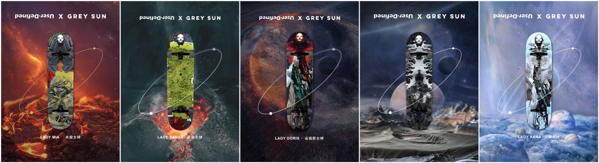
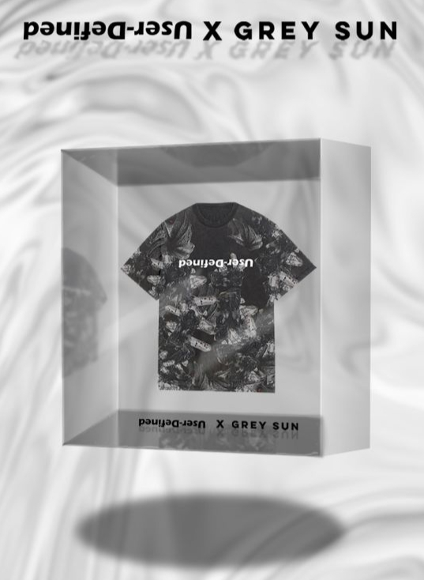
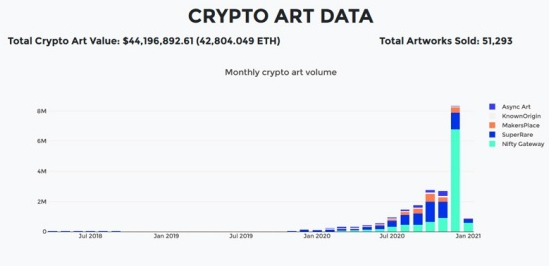

最近一直在看国内国外的数字藏品，虽然选择颇多，但你一定不要胡乱选择。

就像你到了周大福给媳妇选礼物时，金灿灿的一大片，那都叫海货，

顾名思义，都是没有什么特点的，没有”工费“一说。

其他的，比如故宫传承系列、设计师款、明星代言的款式，那就不一样了。

数字藏品也如是，有的缺乏内涵的数字藏品，那不如去闲鱼花三十大洋，画一张，

或者找个软件直接上传原图改一张cartoon版本的down下来，随便用。

我关注的是国外时尚奢侈品牌发布的数字藏品，时尚、青年一代、先锋非主流、奢侈不奢华。

国内时尚数字藏品也不乏一些出类拔萃，潜力很大的“厂牌”。

UD数字厂牌 UD数字藏品 Grey Sun

UD数字厂牌 UD数字藏品 Grey Sun

元宇宙这个概念在2021年爆火，

余温直接带到了新的一年，

元宇宙作为科技社会的最终形态被无数资本所追捧。

2021年3月11日，号称元宇宙第一股的Roblox在纽交所上市，

首日的估值就达到了450亿美元，

成为了2021年全年最热门的话题，

巨头Facebook也将自己的公司名称改为“Meta”，

立下了自己进军元宇宙的决心。

元宇宙的概念不仅在国外火，

其热度也是沿袭到了国内，

很多国内科技巨头也都纷纷在靠拢元宇宙，

腾讯、百度等互联网大厂也都纷纷入局，

社交人气平台B站也不甘示弱。

凭借着元宇宙的热度，

区块链等字眼也开始频繁出现在人们的面前，

虽然区块链在元宇宙爆火之前在自己的领域已经是小有名气了，

但是元宇宙的浪潮将区块链技术推到了更多普通人的面前。

提起来区块链，

还有一个热词不得不出现，

那就是在区块链基础上建设起来的GameFi。

有较为成熟的区块链技术支撑在前，

有爆火的元宇宙知名度加成在后，

GameFi作为一种更容易被普通人接触的产物，

迅速在全球范围内火爆起来。

如何去更好的理解GameFi呢？

GameFi是一种建立在区块链加密技术上所诞生的“金融游戏”，

这个词有点蹩脚，

但“Finance”在这里叫挣钱，

我认为更加直观。

它还不像抖音和抖音极速版的关系，

这里不能多说，嘘嘘嘘嘘！

区块链加密技术是GameFi区别于传统Game最主要的特征，

除此之外，GameFi还拥有着独一无二的DeFi属性。

这也就使得GameFi可以顺理成章的实现“play to earn”的理想。

在GameFi的世界里，

游戏不再只是单纯的游戏，

他对于游戏玩家来说更是一种可以用来投资赚钱的工具，

玩家在游戏里所获得的也不再是无用的数字代码，

而是具有特定属性的有价值的数据，

是可以真实为消费者带来可见资产的数据。

GameFi从开始出现到爆火也是经历了比较长的一段时间，

任何事物的发展初期都是无人关注的，

就像是GameFi，

真正使它进入到人们视线中的则是因为一款名为《Axie Infinity》的GameFi。

早在2018年，

《Axie Infinity》就已经面向玩家用户了，

也是因为疫情这个契机，

让一些失业群体在《Axie Infinity》这种GameFi游戏中获得了正当的收入，

更是有玩家凭借着玩这款游戏实现了人生买房的理想。

当这个消息被爆料出来之后，

《Axie Infinity》名气一飞冲天，

顺带着GameFi的概念一并火了，

在《Axie Infinity》游戏热度最高的时候，

其整年的营收也是超过了《王者荣耀》，

在全球范围内排名第一。

和《王者荣耀》这种群众基数大，

技术背景成熟的传统手游相比较，

《Axie Infinity》的营收位列全球第一不仅仅代表着公司的营收，

其中还有隐藏在幕后的玩家营收，

当游戏开发者和游戏玩家不再出现利益冲突时，

这可能是游戏的一种最完美的平衡状态。

毫无疑问，高人气的热度使得GameFi成为了元宇宙的第一个风口，

2021年的爆火期已经过去，

2022年各路资本持续加持，

不知道GameFi能否在众人关注的赛道下安稳的到达终点呢？