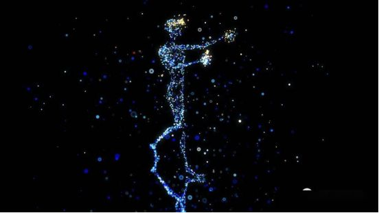
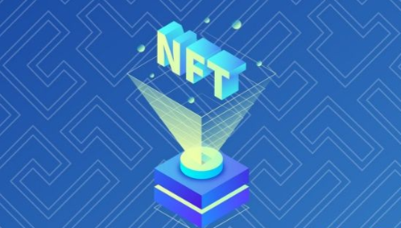

现今，元宇宙成了互联网行业破局的关键，数字藏品、虚拟人、VR/AR等领域都在展开积极布局。国内接触数字藏品是从“皮肤”开始的，2021年6月，支付宝首发敦煌飞天付款码数字藏品，成为国内数字藏品行业真正启航的节点。

面对数字藏品这一风口，国内主要互联网大厂纷纷入局，成为行业发展的主要推手。在过去的2021年，数字藏品NFT的使用率爆发式地增长了110000%。

脱胎于区块链技术的数字藏品NFT天然具有不可复制、不可分割、唯一序列号等特性，也正是基于这些特性建立人与物的唯一编码，是连接虚拟与现实世界对应关系的一种新尝试。

这套“唯一识别”的价值体系，从技术本身以及流通、存储、安全等方面，都为即将到来的“元宇宙”时代做好准备，NFT也将成为元宇宙内数字资产最有效的载体。

比如你收藏一幅画，要让它在虚拟世界变成独一无二的数字藏品，有三种方式。

第一种是极端化。把原件毁灭，那么拥有画的凭证数字化就是独一无二了。

第二种是共存。通过技术手段从原件上提取一些信息，把信息和证明融为一体。藏品是实物，数字化的证明是虚拟的，这两个之间就会发生一些错位。比如有人拿着一幅假画，但有真画的NFT；有人有真画，但没有NFT。这样在虚拟世界里，有NFT的人就可以拿着证裸奔了。这样不管画在哪，拿着证倒卖这些证就行。

第三种是原生作品在数字化世界里产生。所以数字化原生的东西在数字化世界里被付权。这就是元宇宙里的东西了。

一位国外的12岁少年曾通过数字藏品在两个月内收益34万美元，一副名为《The Merge》的数字藏品卖出9180万美元高价。近日，《如花在野·奥妙若兰NO.1》 作为其中的首款元宇宙葡萄酒NFT数字藏品，最终以高达30098元的成交价，掀起葡萄酒NFT数字藏品热潮。

数字藏品NFT的出现，让更多人体验到收藏的乐趣。而一个新概念、新物种的诞生，可能会引发短暂的理解混乱。而随着探索的不断加深，数字藏品NFT或许会在新的一年衍生出更具实际意义的分支产物。