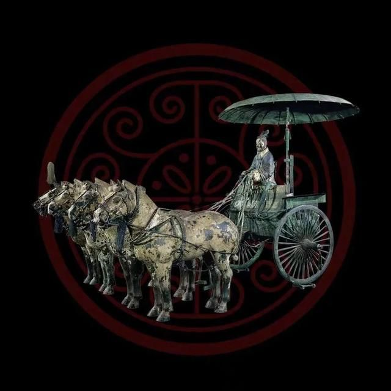
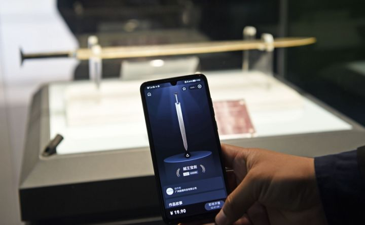

有什么东西是我们能够永久拥有的？

在快消费时代的洪流下，有一个热门答案：**数字藏品**。

2022年元宇宙延续大热趋势，这次**元宇宙x文物藏品**擦出绚烂火花！

**“十四五”规划中明确提出推动博物馆发展线上数字化体验产品。在此背景之下，文博数字藏品应运而生。**尤其是自春节以来，再加上冬奥会的开展，数字藏品借由这股浓浓的年味加快了发展的进程，国内数字藏品火爆出圈。

**数字藏品上线即售罄** 

现阶段，在数字藏品方面“整活儿”最多的无疑是各地博物馆。往近了看，3月1日，秦始皇帝陵博物院正式对外发行其首款文创数字藏品“秦陵彩绘铜车马·一号车”。

往远了看，中国国家博物馆今年年初时就推出过四羊青铜方尊、西汉错金银云纹青铜犀尊等4件国宝级文物的数字藏品，上线即售罄；湖北省博物馆上线的首个数字藏品“越王宝剑”，限量1万把，对外发售，引来60万人在线抢购，短短3秒即告售罄。

**元宇宙X数字藏品** 

区别于实体文物藏品，数字藏品是数字经济环境支撑下的新生事物，是用经过数字化的作品、艺术品和商品。通过数字孪生、3D实景克隆技术赋予了每个文物藏品数字虚拟模型。以线上艺术品形式进行呈现，并能在虚拟元宇宙中流通。

**如何构建数字藏品虚拟模型** 

目前构造三维模型的手段大体有三种：照片建模、人工三维软件建模、利用三维扫描仪建模

**照片建模：**通过相机等设备对物体进行采集照片，经计算机进行图形图像处理以及三维计算，从而全自动生成被拍摄物体的三维模型的技术。

**人工三维建模：**『云上动力』常用3DMAX, Maya等建模软件，为客户提供建模渲染服务。

**三维扫描仪建模：**『云上动力』自主研发生产的专业3D扫描设备YUN-PRO，拥有高清八镜头，全自动精准建模、智能测距，可以满足空间、物件等建模需求，建模时间仅需传统设备的1/20。可运用到多个场景内。

**云上动力提供数字藏品3D克隆技术支持** 

『云上动力』拥有专业优秀的技术团队和丰富的项目实践经验，综合使用这三种3D建模手段，可提供数字藏品3D克隆技术支持，利用3D MAX、Maya等三维建模软件、对物理场景进行一比一精细化建模，同时使用Unity、UE4等引擎打造孪生场景的动态光影、空间反射、动态效果等，使得孪生场景能够更加真实。

此前，『云上动力』已为运城博物馆、广东省博物馆、颐和园博物馆等提供数字孪生、三维实景扫描克隆服务，3D仿真呈现在web端，让所有用户都能身临其境感受文物藏品的千古魅力。

**藏品数字建模** 

『云上动力』对文物进行高精度的数字化采集和三维还原，生成文物“数字孪生体”——数字藏品，展示文物720°全览，**可以放大观看文物细节，通过纹饰、动效的互动方式展示文物的历史故事、文物价值、用途、特征等**，生动有趣地展示文物的前世今生。

三维物体建模支持缩放旋转，人性化交互设计，用户可以在文物“数字孪生体”的任意角度进行缩放、旋转等操作，查看更多文物细节，感受物体还原。

**博物馆数字建模、漫游** 

『云上动力』数字文博创新结合多元的形式，如场景模型和实景漫游、文物数字化等技术，将空间结构信息完整复刻，用户可以随时走进生成的博物馆3D场景中自由探索，感受身临现场的空间漫游体验，踏上一段历史文化之旅。

『云上动力』数字文博解决方案，致力于将璀璨的中华文明，与美轮美奂的数字艺术融为一体，令博物馆、美术馆、非遗传承人所珍藏的一件件文物与艺术品，成为恒久精美的数字藏品。让这些文物与艺术品活起来，走入公众的生活；使这些国之瑰宝，成为有温度的数字藏品。

未来将持续打磨“数实融合”技术和文物科技创新能力，依托扎实的数智化经验，与实体经济深度融合，促进传统文化的数字化“焕活”，助力文化创意产业的数字化破局，促进行业高质量发展。