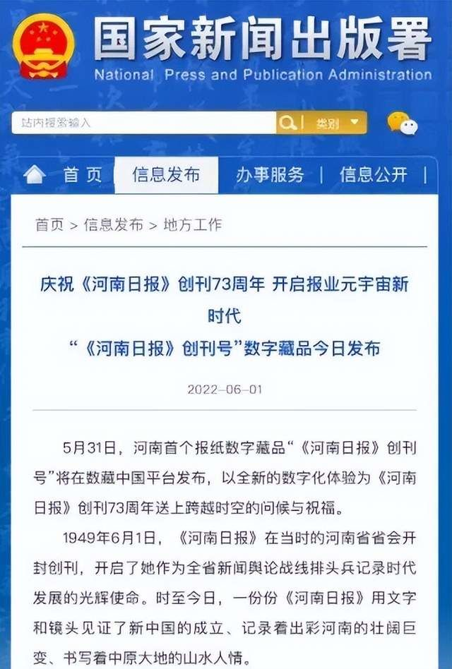

当前，我国进入数字经济时代。数字科技的发展，带来了市场的变革。元宇宙、数字藏品，成为人们耳熟能详的话题和新兴的业务模式。作为新闻舆论、大众化传播重要载体的报纸，如何拥抱元宇宙和数字藏品，《人民日报》和《河南日报》与数藏中国的合作，为人们提供了范式。

数藏中国作为中国领先的数字藏品平台，始终在探索与引领数字藏品行业的健康、有序发展。今年五一劳动节和五四青年节当天，数藏中国联合人民网旗下唯一技术子公司人民科技，先后发行了“《人民日报》第一个数字藏品之新中国第一个劳动节《人民日报》头版”、“迎建团百年，新中国第一个青年节《人民日报》头版”，受到了用户的一致好评，引发了行业的热议与媒体的高度关注。

此后，河南日报报业集团也联合数藏中国于5月31日发布了河南首个报纸数字藏品“《河南日报》创刊号”。发布当天，《河南日报》刊发要闻《庆祝<河南日报>创刊73周年 开启报业元宇宙新时代 “<河南日报>创刊号”数字藏品今日发布》，旗下各大媒体均对此次合作进行了报道。《河南日报》称：“值此创刊73周年之际，以新颖的数字化方式向读者呈现这份珍贵的创刊号，是河南日报报业集团有限公司构建数字产业创新生态体系、拓展传统文化创造性转化新空间、打造传统文化创新性发展新模式的积极探索。”此篇新闻，获得国家新闻出版署的官方点赞，官网全文刊发。

6月1日国际儿童节，数藏中国再度联合人民科技推出“毛主席等领导人亲笔题词的新中国第一个儿童节《人民日报》头版”数字藏品。藏品受到用户的高度喜爱，发售即秒空。

除了《人民日报》和《河南日报》外，《大众日报》、《上海证券报》、《深圳特区报》等报纸也纷纷联合各大数字藏品平台推出了各自的限量版数字藏品。

数藏中国CEO王鹏飞介绍，数字藏品是元宇宙的基石。元宇宙是映射了现实世界而又独立于现实世界的虚拟世界空间，数字藏品实现了元宇宙世界里虚拟事物的数字化、资产化。数字藏品通过区块链技术，对应特定的作品、艺术品生成的唯一数字凭证，在保护其数字版权的基础上，实现真实可信的数字化发行、购买、收藏和使用，使得实体文化在数字经济时代焕发了新的活力。富于文化内涵、收藏价值的文化产品、艺术品，通过区块链加密和全新赋能，成为年轻人喜爱的数字藏品，让文化的传播与传承更加便利。

王鹏飞表示，数藏中国以数字科技为支撑，以文化传承为目标，是一家有责任和担当的数字藏品平台。平台底层采用BSN-DDC网络的开放联盟链技术，合法、合规并可监管。BSN-DDC基础网络基于**区块链服务网络（BSN）**打造，区块链服务网络（BSN）是由国家信息中心、中国移动、中国银联、北京红枣科技联合发起建立的全球性区块链公共基础设施网络。数藏中国联合人民科技、河南日报报业集团推有关数字藏品，旨在铭记历史，引领数字藏品在历史事件传播、精神和政策宣讲、使命和初心传承等方面的作用，为中国文化的传承贡献力量，以期取得较好的经济价值和社会价值。数藏中国通过两大纸媒数字藏品的发行，也开启了他们报业元宇宙的新时代。未来，数藏中国期待携手更多纸媒推出数字藏品，打造中国报业元宇宙。