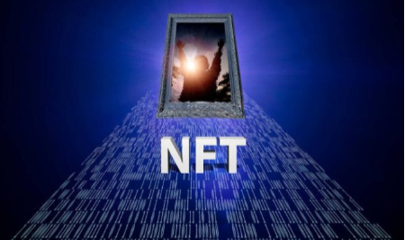

过去二十年，“互联网+”改变了全球商业格局，滋生了阿里、亚马逊这样的电商巨头。今天，“元宇宙+”将如何重塑传统经济？在全球电商领域，谁将成为下一个淘宝？

近期，一个名叫元域洲Space的元宇宙社交商城引发业内热议。这个一出生就自带光环的元宇宙电商APP，要成为“元宇宙+”时代的淘宝。

尽管在“元宇宙+电商”的市场蓝海一片，但要成为一个类似淘宝这样的超级巨无霸，却并非易事。元域洲Space如何做到？

当互联网电商巨头们的地位稳如磐石时，谁会从行业外破坏性创新、打破现有垄断格局？

“元宇宙”概念的提出，为人类社会实现最终的数字化转型提供了新的路径，更繁荣的数字经济将不再只是想象。在新的交互式环境中，电商也会产生颠覆性的变化，全新的互动式购物体验将更加流畅。

元域洲Space融合了NFT、SocialFi、DAO、S2B2C等多重热门概念，通过NET数字藏品+虚拟直播+虚拟空间+智慧社交四大板块赋能传统电商，与元宇宙AR（增强现实）及VR（虚拟现实）底层技术结合，货源保真溯源，商品3D展示，实时同频，同声互动，交易安全透明，打造自营+招商入驻的沉浸式社交电商元宇宙，赋能商家转型，构建完美商业闭环。

自2021年目前为止，元宇宙元年到现如今亦是非常火热的NFT数字藏品，根据行业报告NFT数字藏品，使用率爆发式增长110000%，成为《柯林斯词典》年度词汇。数字藏品成为一新的风口2022年有望迎来爆发。

面对如今的这一新风口，国内NFT数字藏品市场各互联网巨头及科技大厂，纷纷推出自家NFT数字藏品平台，其领先的腾讯及阿里旗下NFT数字藏品App成为国内数字藏品领域发展的主要推动力。

去年6月，支付宝蚂蚁粉丝粒首发NFT数字藏品敦煌飞天付款码皮肤，从此真正打开国内数字藏品领域发展的大门，此后，国内互联网大厂纷纷入局，发布自己的数字艺术藏品。截止目前2022年，数字藏品的发展速度只增不减，春节刚过完，就有不少数字藏品推出来了，而且新的NFT数字藏品平台APP也新增了不少。

各个行业不同领域的企业都推出自家数字艺术品，如小米、哔哩哔哩、安踏、泰康、起点读书、网易、小红书、京东等等，太多的数字藏品APP。截止目前为止已经有上百家平台，而粉丝用户也是越来越多。

现在各路NFT数字藏品APP有很多，虽然藏品的发布初衷是为了让人们能够收藏，但还是有不少消费者更加关心的是自己所抢购的数字藏品将来能否会增值，以及是否可以变现。目前市面上的数字藏品发行根据内容来看，国内的数字藏品均强调引导关注数字藏品的文化与收藏价值。

NFT数字藏品将在不久的二三年后，将会成为元宇宙内数字资产最有效的载体。在相关体系完善之前，数字藏品消费者要理性购买，正确看待数字藏品的属性、价值

总的来说目前NFT数字藏品的发展都已经有了一个较为稳妥的开局，未来的发展前景也颇受期待，做一款属于自己或企业的NFT数字藏品APP也是非常不错的尝试。