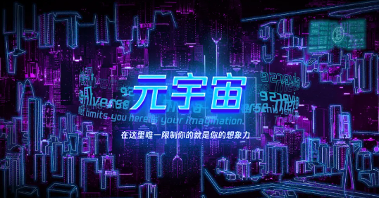

　　一种新的产业正在上海萌芽，可能改变上海的城市面貌和产业地图。今年7月，上海市政府在多个经济规划中对元宇宙（Metaverse）着墨较多。

　　从科幻概念到落地生根成为产业，元宇宙或将具备千亿产值的潜力。一批上海科技产业从业者告诉记者，他们正围绕元宇宙，进行产业链的环环突破，不仅将形成又一经济增长点，还将改变上海的城市生活。

　　在国家数字经济战略里，元宇宙或是下一块拼图。在城市竞争的众多赛道中，元宇宙会为城市未来发展带来什么？

　　**上海，正与未来握手**

　　一批上海的产业正向元宇宙聚拢。

　　上海几位创业者向南方财经全媒体记者介绍，他们正围绕AIDC（智能数据中心）、数字内容引擎、AR（增强现实）双目眼镜等担当元宇宙世界的“建筑师”。元宇宙到底是什么？受访者众说纷纭，但都相信从业者正与未来握手。

　　“商汤正在做元宇宙的基础设施能力搭建。”商汤科技数字空间事业群数字文娱事业部总经理栾青向南方财经全媒体记者介绍，“数字内容引擎是其中重要的一环。”

　　元宇宙一大核心是三维数字场景建设，其中一个方向是如何将现实世界搬到数字世界。栾青解释，“数字内容引擎”是一个技术平台，提供多种开发者需要的关键能力，令开发者能更加方便地开发元宇宙中的数字内容。和传统软件技术平台不同，元宇宙所需要的数字内容引擎涉及感知、互动、决策，以及VR、AR、MR（混合现实）等新功能。“借助数字内容引擎，可以便捷生成数字内容，包括元宇宙的三元素：Avatar（虚拟化身）、数字人（虚拟三维形象）和三维场景等内容。”

　　据介绍，商汤“数字内容引擎”的算力基座——商汤人工智能计算中心AIDC于今年1月落户上海临港新片区，将成为亚洲最大的人工智能计算中心之一。与此同时，商汤总部坐落于徐汇区漕河泾，今年6月，上海市政府宣布将在这个区域建设一个元宇宙产业园。

　　在张江高科技产业园，元宇宙厂商正在打造进入虚拟世界的通道。

　　“像智能手机一样，元宇宙设备能承载互联网的未来。”亮风台信息科技联合创始人兼COO（首席运营官）唐荣兴向南方财经全媒体记者表示。

　　目前，国内外不少厂商都潜心制造使用AR或VR（虚拟现实）技术的头戴设备，希望能再创“苹果奇迹”。“这种工具同时具备empower（提高生产力）和enjoy（娱乐）的属性。”唐荣兴说。AR眼镜正在走向智能制造工厂、公共服务、文化娱乐等各行各业，结合AR软件系统，给工程师和技术工人带来更高效的机器协作体验，也能令游客得到与众不同的观景体验。

　　“上海给了我们良好的产业基础和市场空间。”唐荣兴告诉记者，上海的集成电路产业集群为AR眼镜的开发提供了必要的芯片、光学镜片、组装产线等，而娱乐互联网、文化资产、制造业等又提供了丰富的产品推广空间。

　　上海企业已在元宇宙的基础设施建设和内容建设上展开行动了，尽管如此，当问及元宇宙定义时，尚无定论。部分观点认为，必须形成大规模虚拟生活空间才可称之为元宇宙。唐荣兴认为，目前在垂直领域、特定场景做好技术深耕已经是元宇宙建设的第一步。

　　“一家公司将能引发一个行业的共振，一个小场景也会跨界感染更大生态，那时候将形成更理想的元宇宙。”唐荣兴称。

　　无论如何，从业者们都相信元宇宙是互联网的下一个承载者，也是能够实现的未来预期。

　　**从虚幻概念到扎根城市**

　　元宇宙原本是科幻小说里的一个虚幻概念，但如今已然落地生根，在现实的产业中萌芽。自2021年下半年以来，不少海内外知名企业和城市表达了对待元宇宙的严肃态度，而上海也将元宇宙纳入了城市的产业规划版图中。

　　有通信产业专家向南方财经全媒体记者指出，发展元宇宙是推动国家重大战略实施、促进技术要素向现实生产力转化、发展国家科技核心竞争力的重要举措。

　　从政策、产业园、科创等角度，上海从政府层面接纳了元宇宙概念，并给予了产业政策层面的发展支持。中国移动通信联合会首席数字战略官杜正平告诉南方财经全媒体记者，元宇宙建设正是落地国家数字经济战略、推动数据要素探索的一部分，“上海对元宇宙的接纳，反映了上海市基于城市定位对国家数字经济战略的具体承接和快速落实。”

　　政策面上，截至7月20日，元宇宙已被上海写入数份政策文件，包括《上海市数字经济发展“十四五”规划》《上海市产业地图（2022）》《上海市培育“元宇宙”新赛道行动方案（2022—2025年）》等，以及上海市通信管理局制定的《5G应用“海上扬帆”行动计划（2022—2023年）》和虹口区政府公布的“元宇宙产业发展行动计划”等。

　　产业空间和科创培育方面，上海16个行政区中的部分地区为元宇宙专设了发展空间。其中普陀区在中以（上海）创新园鼓励企业进行三维技术软硬件研发、三维影棚落地和元宇宙内容制作；虹口区打造了元宇宙虹口1号和2号空间，计划进行产业培育和企业引进，并推动更多应用场景落地。

　　此外，上海也在6月首次将元宇宙与集成电路、生物医药等产业并列，推进相关特色产业园建设。其中张江数链产业园将围绕连接、交互、计算、工具、生态五大板块，进行元宇宙技术研发、数据服务、数字创意、赋能应用等。漕河泾“元创未来”元宇宙产业园目前已经聚集了一批顶尖研发机构、100余家相关重点企业、250余家人工智能全产业链企业以及约90家集成电路企业，包括微软技术中心、腾讯优图实验室、Arm智能计算产业技术创新联合体、星环大数据产业技术发展促进中心等平台机构，以及商汤、依图、米哈游、育碧等知名企业。

　　通过政策和产业规划，上海市政府肯定了元宇宙的经济价值，相信这个产业将能带来重大的产业产值规模。根据7月初公布的《上海市培育“元宇宙”新赛道行动方案（2022-2025年）》，到2025年，上海的元宇宙相关产业规模或将达到3500亿元，且将带动软件和信息服务业规模超过15000亿元、电子信息制造业规模突破5500亿元。

　　近年来，国家高度重视要素市场化配置体制机制建设，将数据作为与土地、劳动力、资本、技术等共同并列的核心生产要素，并重点关注新要素的供给活力和成果转化效率。杜正平指出，元宇宙需要依托新一代数字技术和数据要素作为核心推动力，包括云计算、大数据、区块链、物联网、人工智能、AR/VR/XR（混合现实）、隐私计算、量子计算等。

　　“为迎接必将到来的未来数字世界，我们还面临着很多世界级的技术挑战。”杜正平表示，这包括万亿规模的连接、以光子计算为基础的超级算力、基于海量多模态数据的知识自动提取能力、每秒PB级访问吞吐速度的新存储，还有打通听觉、视觉、嗅觉等多个感知界限、计算与感知相结合、多模交互的超现实体验等。发展数据要素和数字技术对推动我国数字经济建设至关重要，同时全球最大规模的城市化进程和最大规模的数字化进程交织，可能帮助我们探索出一条更可持续的人类现代化发展路径。

　　杜正平认为，作为新一代数字科技的集大成者和新型应用场景，元宇宙将成为国家科技竞争力的重要组成部分，而基于在中国乃至全球数字经济和科技竞争当中的核心定位，上海应当建成全球元宇宙技术的统一体验集群和创新集群，这将涉及展示中心、路演中心、开放实验室、协同创新中心、产业基金群、企业创新总部等建设。

　　**新科技重塑上海国际大都市形象**

　　深远的产业规划，对社会大众而言仍有些抽象，然而元宇宙眼下已经悄然进入普通人的生活。元宇宙将给城市的生活空间带来什么改变？带来哪些别样的体验？

　　据从业者介绍，上海市民将在不久的将来于旅游、公交、工厂生产中体验到元宇宙，而上海的科技之城形象也将因此更加丰满。

　　今年3月26日，包括上海博物馆、上海科技馆、上海自然博物馆、上海市历史博物馆以及部分上海高校在内的60位馆长、学者联名发布《关于博物馆积极参与建构元宇宙的倡议》，元宇宙将对数字藏品、文物保护、博物馆研究、展品陈列、知识传播与教育等带来新气象。

　　据此前报道，上海科技馆已经将数字人运用到了科普会场，上海市历史博物馆已对包括镇馆之宝“百子大礼轿”在内16件文物进行了1:1数字孪生。

　　唐荣兴向南方财经全媒体记者介绍，公司正向上海的旅游互联网和制造业提供基于AR平台的产品与方案。“我们目前为客户的一些特定场景，进行深入的垂直化打造，建立了一些从AR基础能力到工具集再到解决方案的平台化端云服务。”在上海的工厂中，工程师可以在免操作手册的情况下，用AR眼镜完成机械安装和检测，并实现远程客户沟通。

　　在临港的产业园区，也在规划着各类元宇宙元素。“比如园区内的巴士由AR进行各种园区信息的完整展示，丰富乘客的导航导览体验。”栾青向南方财经全媒体介绍称。大家办公也许会进入元宇宙办公和会议系统、公司的前台和行政由数字人服务替代，每个人都将拥有自己的数字名片等，这些都可能在规划园区企业得以实现。

　　目前，上海不少银行也已经开始采纳数字人员工。数字人通常担任客服角色，具有真人形象，但更重要的是，数字人的“大脑”喂足了知识库和业务数据。“数字人可以从事标准化的工作，通过人工智能手段输入的专家知识库可以令其生成更严谨的工作步骤。”栾青称。

　　通过在上海实现具体的场景落地，元宇宙企业可以进一步磨练技术。唐荣兴介绍，在服务智能制造产业客户的过程中，AR技术服务提供者不断深入了解客户的需求：是需要更智能的身份捕捉，还是语音准确识别，抑或远端协作的快速数据传输。这些反馈不断促使AR设备商改进核心能力，直到最后形成真正的技术“护城河”。

　　“可以明确，元宇宙绝不是某个单一互联网或科技巨头面向人类未来数字世界的宏大叙事，而是一种全社会群众共同讨论，不断相互启发、逐渐成熟的创新涌现的必然结果。”杜正平称。他指出，元宇宙产业的发展和应用，将促使上海的科技创新创业加快发展，也会改变整个城市的社会和经济面貌。“元宇宙可以同时凸显上海的产业、科技、金融、消费特色，同时体现国际国内市场交汇优势，兼具东西方人文艺术浪潮，这有利于人类进入数字经济时代后，上海重塑面向全球的崭新国际大都市形象和独特的科技与产业竞争力。”

　　**争议之下元宇宙“城建”仍然火热**

　　在元宇宙走红之际，争议也随之而来。元宇宙是否营造了一个虚幻的美丽泡沫？如何辨识从业者的实力和营销？很多人依旧对元宇宙持有谨慎观望的态度。

　　一些企业向南方财经全媒体记者给出了耕耘思路，试图打破质疑。有从业者称，“未来不是预测出来的，而是创造出来的。”

　　有律师向南方财经全媒体记者表示，元宇宙行业从业者应该尽早展开知识产权的法律保护，避免未来受制于人。

　　对元宇宙产生质疑和争议的一大起源，就在于当前的元宇宙用户体验。以VR头戴设备为例，商家所宣传的沉浸式体验卖点，并不足以描述用户的真实感受。“眩晕感，以及时间稍长后设备‘烧脸’，这都是当下设备商还在努力解决的问题。”一位VR行业从业者向记者表示。

　　再以三维会议软件为例，交互感弱、延时感强，将会直接导致用户放弃使用。有从业者还向记者反映，连avatar（真人的数字模拟，或称为“化身”）设计也是一大难题。“这里的审美有一个微笑曲线，十分逼真或完全卡通，通常容易被接受，但若介于两者之间，就变得无法接受。”在三维会议里需要“捏人”的这一步骤，因此也成为一项用户障碍。

　　最后，元宇宙生态建设也将是重大议题。“究竟应该先有硬件还是先有软件？这就好像先有鸡还是先有蛋的问题一样。”一位医疗行业的人工智能从业者对记者说，现在硬件设备商希望软件端先造出丰富场景，而软件端希望硬件端先解决过热、眩晕问题。生态的贫瘠，将导致大众用户难以轻易为元宇宙付费。

　　针对上述问题，唐荣兴指出，目前AR设备将先从企业端入手，再向消费级渗透。通过对企业的垂直化深耕，可以形成初步的行业积累。“不要过度高估两三年的变化，也不要低估十年的变革。”

　　“从基础设施到硬件，中国的元宇宙产业链非常全面，也将具备迭代优势。”栾青称，从研究资源到人才储备，从业者也有信心进行技术的逐一突破。

　　在元宇宙“建造者”行动的同时，也有人正为这个虚拟世界的规则建立做准备。“目前，有关区块链和NFT的法律判决往往具有强烈的引领性意义。”长三角知识产权发展联盟秘书长郭国中向南方财经全媒体记者表示。

　　郭国中介绍，元宇宙不会是法外之地，但目前围绕这个领域展开的法律行动往往需要法理性的辩证。“到目前为止，还没有地方性的法律法规出台，但我相信将有龙头城市率先给出示范。”

　　眼看元宇宙的“城建”正在全球各地如火如荼地展开，郭国中指出，国内从业者需要提高对这个领域的知识产权关注。

　　“专利申请是谁提前申请、就归谁所有。”郭国中提醒，不少元宇宙先行公司、国际公司已经在大规模地布局元宇宙专利申请，“（国际公司的专利布局）一旦涉及中国从业者的从业区域，中国从业者就会陷入被动。”